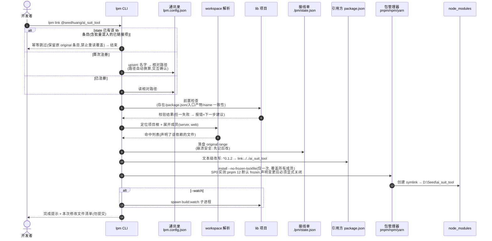
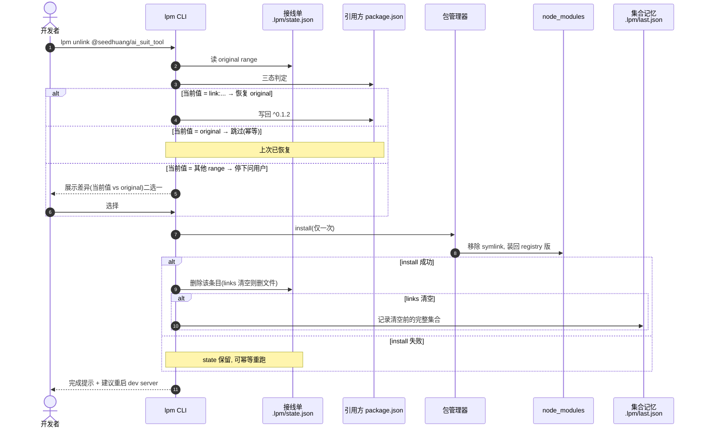
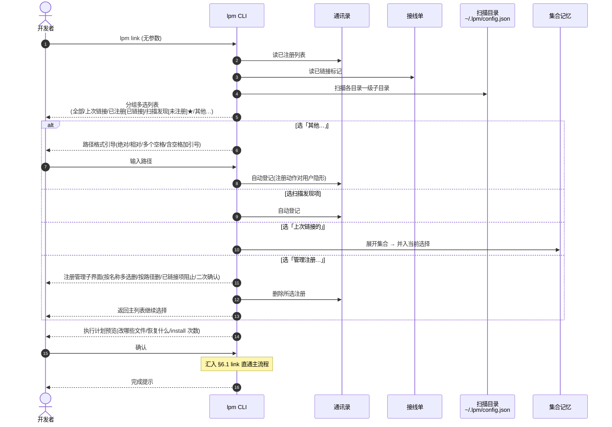
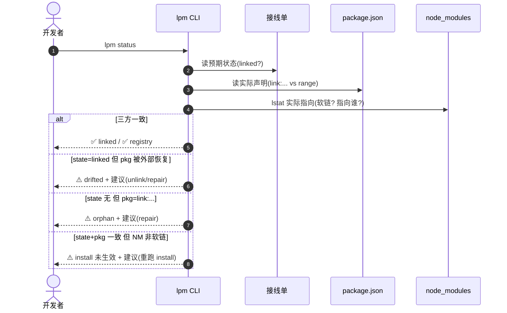
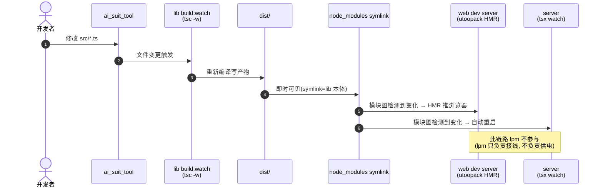
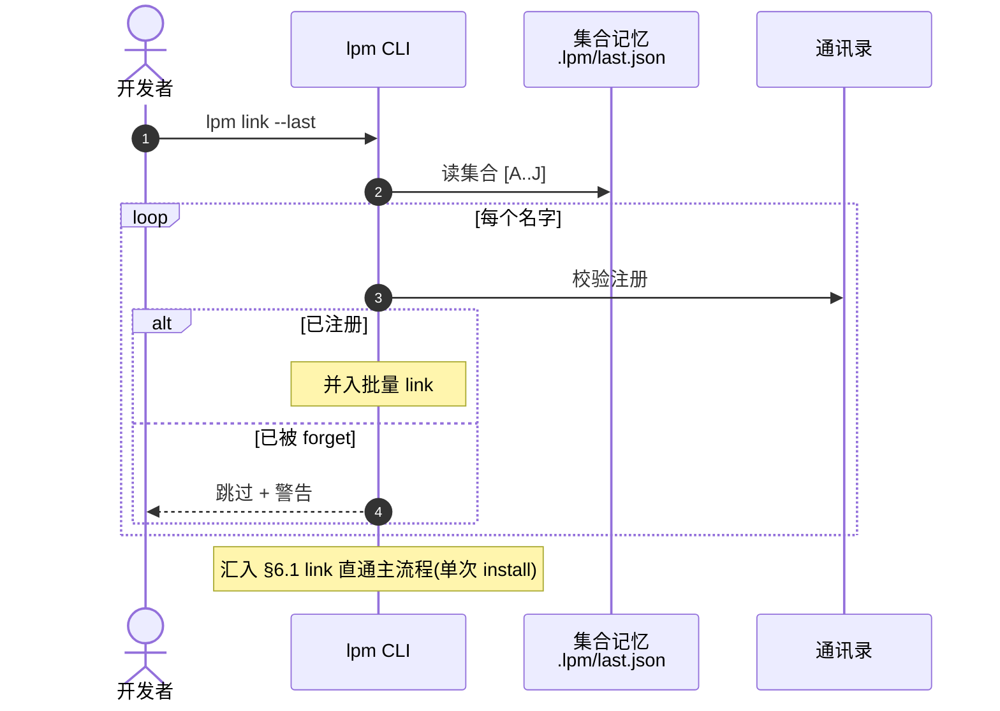

# lpm（Local Pack Manager）PRD · v1

- 日期：2026-09-25
- 状态：待评审
- 范围：本地 link 联调（lpm 的第一个子域）

## 1. 背景与问题

lib（如 @seedhuang/ai_suit_tool）与主项目（如 bilibili_favorite_manager）分仓开发、npm 发布交付。联调痛点：

- 改一行 lib 要 publish → 主项目升级 → 装包，反馈回路以分钟计
- 手动 link（pnpm link / npm link）行为随 PM 不同，全局软链污染，恢复困难
- 切回远端版本时忘了原来的 range
- 多库联调、批量切换无工具支撑

lpm 定位：管理组件/类库/发布/cli 的 npm 生态命令行工具（简写 lpm）。v1 只做子域：**本地 link 与远端版本的切换**。

## 2. 目标与非目标

**v1 目标**

1. 一条命令把 workspace 内某依赖从 registry 版切到本地目录（link），一条命令切回（unlink）并精确还原
2. pnpm / npm / yarn(classic/berry) 的差异被 lpm 吸收（协议映射）
3. 批量操作 + 集合记忆（--last / --all / --preset），N 个库一键恢复
4. 交互模式无需 readme：空态向导、错误即建议、执行计划预览
5. 状态可见：lpm status 三方核对，漂移可检测可修复
6. 切换零配置负担：除 lpm 自身状态文件外，引用方配置不动（或仅注入一次自感知片段）

**非目标（v1 明确不做）**

- 包发布 / 版本管理 / changelog（未来子域）
- 不监听文件变化、无常驻进程（刷新由 lib 的 build:watch 与引用方 dev server 完成）
- 不自动处理 lib 之间互引（只检测 + 警告）
- 不代写新依赖（不在依赖声明里的库提示先 pnpm add 再 link）；**未发布过的新 lib 首次接入同样不支持**（`pnpm add` 在 registry 找不到会失败，需先手动 `pnpm add file:../lib` 声明后再用 lpm 接管）——"lpm add" 留作 v2 候选
- npm / yarn 标"实验性"（协议映射就绪，不做全量集成测试）
- 全局通讯录（跨项目共享 lib 地址）推迟
- 不自动 git stash/restore link 期间的脏文件

## 3. 用户与核心场景

用户画像：lib 与主项目的同一作者，Windows + pnpm 为主。

- **场景 A（主验收场景）**：BFM（pnpm workspace：server + web）联调 ai_suit_tool。link → lib 侧 build:watch → web HMR / server(tsx watch) 自动重启 → unlink → git diff 恢复原样
- **场景 B（批量）**：10 个 lib 联调；unlink --all 后数周，lpm link --last 一键恢复
- **场景 C（协作）**：lpm.config.json 进 git（相对路径）；同事 clone 后目录结构一致即可 lpm link <名字>；不一致则带路径重新注册（upsert）
- **场景 D（无 readme 引导）**：新项目裸跑 lpm link：PM 自动推断 → 空态向导 → 扫描列表选择 → 完成

## 4. 核心概念与术语

| 术语 | 定义 |
|---|---|
| 引用方项目（host） | 声明依赖、运行 lpm 的项目（如 BFM）；一切状态以它为单位 |
| lib | 被联调的本地库项目（如 ai_suit_tool） |
| 通讯录 | lpm.config.json：lib 名 → 相对路径；进 git；永久 |
| 接线单 | .lpm/state.json：当前活动 link + 每个文件的原始 range；撤销凭证；gitignore |
| 集合记忆 | .lpm/last.json：最近一次"完整链接集"；gitignore |
| 漂移（drift） | state 与 package.json 实际值不一致（被外部改动） |
| 管辖范围 | workspace 清单成员 + 根；lpm 世界观与 PM 完全一致，清单外不碰 |

## 5. 总体机制

**机制：改写依赖声明（方案 A）**。link = 把命中声明改写为本地协议 + 一次 PM install；unlink = 按接线单恢复原 range + 一次 install。状态显式（git diff 可见）、无全局污染、三 PM 行为统一。

**协议映射**：pnpm / yarn-classic → `link:`；yarn-berry → `portal:`；npm(≥7) → `file:`（目录语义即软链）。相对路径基于各声明文件所在目录换算，永不写绝对路径。

**刷新链路（lpm 管接线，不管供电）**：lib src → lib build:watch → dist →（symlink 即时可见）→ 引用方 dev server 热更/重启。lpm 无监听；link --watch 仅代为拉起 lib 的 build:watch 子进程——**lpm 随此前台运行，Ctrl+C 同时终止两者，link 状态不受影响**（下次需要再手动起或再带 --watch）。

**配置零负担（SP0 两轮实测，机制终版）**：SP0 第一轮证实——utoopack 虚拟 FS 锚定 rootDir（默认探测 monorepo 根），`link:` 指向根外的 lib 一律 Module not found，`utoopack: { root }` 扩边界后解析可用。第二轮（用户从截图发现样式分裂）证实——**antd 双实例**：link 模式下 lib 的 antd 解析到 lib 自己的 devDeps 实例，React 单实例所以 hooks 不炸，但 lib 组件脱离 BFM 的 ConfigProvider 主题上下文，呈现 antd 默认亮色（静默失败）；peer dedupe alias（react/react-dom/antd/@ant-design/icons → 宿主实例）后恢复暗色且零报错。因此 S13 终版机制 = **root 注入 + peer dedupe alias 注入**，两者都是 lpm init 一次性注入的自感知配置。registry 正式包无此问题（pnpm peer 解析天然单实例）。

## 6. 核心流程时序图

时序图说明各功能的前后逻辑与涉及方。图中 `lpm CLI` 为命令执行主体，配置文件为数据落点，`包管理器` 为安装动作执行者，`node_modules` / `lib 项目` 为被作用对象。

### 6.1 link 直通（核心机制）

### 6.2 unlink 直通（三态恢复 + 崩溃安全）

### 6.3 link 交互（傻瓜引导）

### 6.4 status 三方核对

### 6.5 运行期联调链路（lpm 不参与，供电方）

### 6.6 link --last / --all / --preset（集合恢复）

## 7. 命令全集

| 命令 | 直通用法 | 交互模式（无参数时） | spec |
|---|---|---|---|
| lpm use | lpm use <pnpm\|npm\|yarn>；默认自动推断——优先级：**lockfile > packageManager 字段 > workspace 清单**（清单仅能识别 pnpm：pnpm-workspace.yaml；npm 与 yarn 的清单同为 package.json workspaces，必须靠 lockfile 区分）；多 lockfile 共存（迁移期）→ 判定歧义，提示手动指定；yarn 细分：有 .yarnrc.yml 或 yarn.lock 含 `__metadata` → berry（portal:），否则 classic（link:）；手动指定与现有 lockfile 冲突时警告 | 首次任何命令未设定则询问 | S3 |
| lpm link | lpm link <名字\|路径>... [--watch] [--dry-run]；--last / --all / --preset <名>（三者互斥） | 分组多选 + 空态向导 + "其他"路径引导 + 列表内管理注册 | S6/S9/S10/S11 |
| lpm unlink | lpm unlink <名字\|路径>... [--all] [--dry-run] | 已链接列表多选（显示恢复去向）+ "按路径取消…"入口 | S7/S9 |
| lpm status | lpm status [--json]（JSON 供脚本与 E2E 测试消费） | — | S8 |
| lpm repair | lpm repair | 交互确认 | S8 |
| lpm save | lpm save <预设名>（当前链接集存为预设） | — | S10 |
| lpm preset | lpm preset / lpm preset rm <名> | 列表管理 | S10 |
| lpm forget | lpm forget <名字\|路径>（须先 unlink） | 已注册未链接列表多选 | S11 |
| lpm dir | lpm dir add <路径> / rm / ls（用户级扫描目录） | 管理 | S11 |
| lpm init/uninit | 注入/摘除 web 配置自感知片段（条件立项） | diff 预览确认 | S13 |

未知命令模糊纠错（如 lpm lnik → 建议 link）。全局支持 --dry-run / --help / --version。

## 8. 交互设计

原则：无参数=交互引导，带参数=直通；空态即向导；错误即建议；完成即提示；长任务（install，可达分钟级）必有进度反馈与预期时间提示，禁止死屏等待。

关键界面（细节在 S9 spec）：

1. **link 主列表**：虚拟项「全部已注册」「上次链接的（无记录则隐藏）」；分组「已注册」（[已链接] 标记，**勾选时界面即时提示"已链接，将跳过"**——反馈前置，不等执行后）/「扫描发现」（[未注册]，选中即隐形注册）；依赖交集排序置顶 ★；「其他…」→ 路径格式引导（绝对 / 相对 / 多个空格分隔 / 含空格加引号）；「管理注册…」→ 进入注册管理（见 2）
2. **link 注册管理**（列表内删除注册 = forget 的交互化，用户无需另记 forget 命令；子界面标题与视觉模式须与主列表明显区分——加法/减法心智隔离，防用户误以为还在选要链接的库）：
   - 已注册列表多选删除（按名称）；「按路径删除…」→ 输入路径（**多个用空格分隔、含空格加引号**，格式引导同"其他…"）→ 解析包名 → 并入删除列表
   - 勾中 [已链接] 项 → 阻止并提示「先 lpm unlink，或改用 lpm unlink」——绝不悄悄既拆线又删档
   - 确认删除前二次确认（有后果操作：删除后需重新带路径注册）
   - 删除成功提示「已移除注册：@x/y，以后想再联调需重新带路径注册」
   - 直通等价命令：`lpm forget <名字|路径>`（快捷用）
3. **unlink 列表**（按名称/路径取消链接，与 link 的「管理注册」对称；此处的"删除"= 取消链接）：
   - 仅显示已链接项；每项含 包名 + [链接的子包] + 将恢复的 range；drift 项标记 [漂移]
   - **按名称**：空格勾选（多选）→ 回车确认 → 进入执行计划预览
   - **按路径**：「按路径取消…」入口 → 输入路径 → 解析包名 → 已在链接列表则并入取消集合；未在则提示「当前未处于链接状态」并列 status 建议
   - 勾选即进入执行计划预览（可逆操作：lpm link --last 可恢复，不二次确认；执行计划确认即提交）
   - 直通等价命令：`lpm unlink <名字|路径>... [--all]`
4. **执行计划预览**：改哪些文件 → 恢复什么 → install 几次，然后执行。三态判定（§10）**统一前置**：交互模式在预览阶段、直通模式在执行开始前，一次性判定所有文件并把"当前值 ≠ original"的项就地让用户选择完毕——**禁止执行中途打断**（用户已进入等待执行心智，中途弹选择是交互大忌）
5. **空态**：无注册 → 向导（输路径 / 加扫描目录 / 退出）；无链接 → 提示 link / status / forget 三去向
6. lib 路径是 monorepo 根 → 列出成员包让选

## 9. 文件与数据

1. **项目级 lpm.config.json**（git 提交）：
   `{ version, packageManager, libs: { 名: 相对路径 }, presets: { 名: [名...] } }`
2. **项目级 .lpm/state.json**（gitignore）：
   `{ version, links: { 名: { original: { "<相对路径>/package.json": range }, linkedAt } } }`
   links 清空即删文件（兼作 web 片段的开关信号）
3. **项目级 .lpm/last.json**（gitignore）：`{ names: [...] }`
4. **用户级 ~/.lpm/config.json**：`{ version, scanDirs: [绝对路径] }`
5. **.gitignore**：首次创建 .lpm/ 时检查并提示追加

**崩溃安全的写入顺序**：link = 先落 state → 再改 package.json → install；unlink = 先恢复文件 → install 成功 → 才删 state（失败重跑幂等）。所有 lpm 状态文件的写入均为**原子写**（临时文件 + rename）——防双终端并发（左 link 右 unlink）或进程中断把 state.json 写坏。

**重复 link 的幂等规则（防 original 永久丢失）**：link 时若 state 已有该 lib 条目（含批量选择中混入的已链接项、交互列表勾选 [已链接] 项）→ **保留原条目原样不动**，该 lib 跳过改写并提示"已链接"。绝不可在已链接状态下从 package.json 现读 original——那会把 `link:...` 顶掉原始 range，造成永久丢失。original 的读取仅发生在"state 无条目"时。

**非 lpm 管理的本地链接检测（防 original 污染）**：link 时若当前依赖值已是本地协议（`link:` / `file:` / `portal:`）且 state 无该 lib 条目 → 说明用户手动 link 过。禁止把该值记为 original（否则 unlink 会"恢复"成 link 路径，用户误以为已切回远端）。处理：警告 + 三选一——从 git HEAD 读原值（文件有 diff 时）/ 手动输入原 range / 放弃 link。

**package.json 改写为文本级替换**（保持缩进 / key 顺序 / 尾随换行），仅动命中行的 value。命中范围：dependencies / devDependencies / optionalDependencies；peerDependencies 不改写仅警告。

## 10. 状态判定与漂移

status 三方核对（state / package.json 实际值 / node_modules lstat）：

| state | pkg.json | node_modules | 判定 | 动作 |
|---|---|---|---|---|
| linked | link:... | 软链→lib | ✅ linked | — |
| 无 | registry range | 实体 | ✅ registry | — |
| linked | registry range | 任意 | ⚠️ drifted | 提示 unlink / repair |
| 无 | link:... | 任意 | ⚠️ orphan | repair（问用户 / 从 git 恢复） |
| linked | link:... | 实体/旧指向 | ⚠️ install 未生效 | 提示重跑 install |

**pnpm "Already up to date" 陷阱（SP0 真实案例）**：link → 恢复 package.json/lockfile 后，`pnpm install` 判定 manifest 与 lock 一致即跳过 node_modules 重建，**软链残留**；甚至手动删除软链后再 install 仍不补建（.modules.yaml 状态缓存）。因此：① lpm 的 unlink 在 install 后**必须 lstat 验证 node_modules 实际指向**，残留软链/缺失时以 `--force` 重建并告知用户；② 该案例证明了三方核对第三步（lstat）不可省略。

**软链判定的 Windows 兼容**：`lstat().isSymbolicLink()` 对 junction 返回 false——而 pnpm 在 Windows 无特权时对 `link:` 依赖**回退创建 junction**。三方核对的第三步必须同时兼容 symlink 与 junction（realpath 比对或 reparse point 判定），否则在 Windows（BFM 环境）会全盘误报"install 未生效"。

**unlink 三态恢复**（防覆盖手动改动）：

- 当前值 = link:... → 恢复 original
- 当前值 = original → 跳过（幂等）
- 当前值 = 其他 range → 停下，展示差异，用户选（用当前 / 用 original）
- state 记录的文件已不存在（workspace 成员被删/改名）→ 跳过该文件 + 警告，其余照常

**last.json 更新规则**（只在集合级操作后更新，值为"操作后的完整链接集"）：

| 操作 | last |
|---|---|
| link 多个 / --last / --all / --preset | 操作后全部 links 的 keys |
| link 单个（增量） | 不动 |
| unlink 单个 | 不动 |
| unlink --all / 拆至清空 | 清空前的完整集合 |

## 11. 错误处理政策

每条错误必须带"下一步动作"：

| 错误 | 附带建议 |
|---|---|
| lib 路径不存在 | 支持的路径写法提示 |
| lib 无 package.json | 不是 npm 包 |
| lib 是 workspace 根 | 列成员包选择 |
| lib node_modules 为空 | 先在 <lib路径> 执行 pnpm install |
| lib 入口产物缺失（按 exports/main 解析入口） | 先 build / 起 build:watch |
| lib 实际 name ≠ 通讯录 key | 提示 upsert 更新注册 |
| 目标不在任何成员依赖中 | 先 pnpm add <名> 再 link |
| 选择的 PM 与 lockfile 冲突 | 警告并确认 |
| install 失败 | 保留 state，给出重试 / 诊断命令 |
| install "成功"但 node_modules 未生效（pnpm Already up to date 陷阱，见 §10） | lpm 侧 lstat 复验 + `--force` 重建（SP0 实测：恢复 range 后软链残留、删链后也不补建） |
| repair 也无法处理 / state 损坏 | 输出**手工逃生三步**：① `git checkout -- <受影响>/package.json` 还原声明 ② 删除 `.lpm/` 目录 ③ 在 workspace 根重跑一次 PM install——任何 lpm 状态都是可抛弃的重建物，源码与 package.json 才是真相 |

**逃生门原则**：lpm 的全部状态文件（state/last/config）都设计为"可删除后重建"——删掉后最坏后果是重新注册一次路径，不丢任何用户数据。所有异常态的提示语都要指向这一事实，杜绝"工具坏了用户被锁死"。

## 12. 兼容性矩阵

| PM | 协议 | 支持等级 |
|---|---|---|
| pnpm | link: | 全支持（以 BFM 实测为准） |
| npm (≥7) | file: | 实验性 |
| yarn classic | link: | 实验性 |
| yarn berry | portal: | 实验性 |

Node ≥ 22.12（依赖链要求，2026-09-25 OCR 评审修订）；Windows 优先（BFM 环境）；lpm 自身不创建 symlink（由 PM 创建），无管理员特权要求。实验性 PM（npm/yarn）以 **smoke 手测清单**验证（link → install → status → unlink 全链各走一遍），不做自动化集成测试；软链判定兼容 symlink 与 junction（见 §10）。

## 13. 验收标准（E2E，以 BFM + ai_suit_tool 为基准）

1. link 后 node_modules/@seedhuang/ai_suit_tool 为软链指向 D:\Seed\ai_suit_tool；server、web 两处声明均改写
2. lib 改代码 + build:watch：web 页面 HMR 生效；server（tsx watch）自动重启生效（前置：BFM 需自行把 server dev 从 `tsx` 改为 `tsx watch`——BFM 侧改动，非 lpm 交付物；建议在 SP0 实验时一并完成）
3. unlink 后 git diff：server/web 的 package.json 恢复原样（pnpm-lock.yaml 允许等价变化，超出记 bug）
4. 批量 link N 库仅执行 1 次 PM install
5. unlink --all 后 lpm link --last 恢复完整集合，original 逐文件精确还原
6. 漂移场景（手动 git checkout package.json）被 status 正确报告，repair 可清
7. unlink 时若 range 被手动升级，触发三态确认而非静默回滚
8. 全新目录裸跑 lpm：不看 readme 完成首次 link（PM 推断 / 空态向导 / 路径格式提示）
9. 单测覆盖：改写引擎（**golden file 测试**——真实世界 package.json 样本集：CRLF/LF、BOM、2/4 空格与 tab 缩进、单行依赖块，改写后 byte 级断言仅目标行变化）、workspace 解析（三清单格式 / glob / 排除）、协议映射、状态判定全矩阵（含 Windows junction fixture）、**--dry-run 输出与真实执行计划的一致性校验**（dry-run 骗人比没有更糟）。**崩溃恢复用状态构造法测试**：直接构造"state 已写/pkg 未改""pkg 已改/install 未跑"等中间态排列，断言重跑收敛——不用进程 kill（不可重复）。验收 1/3/4/5/6/7 为自动可验证，验收 2/8 为人工验证（HMR 观察与新用户走查）

## 14. Spec 拆分与依赖

**技术选型（v1 定版）**：TypeScript（Node ≥ 22.12，ESM）；CLI 框架 commander；交互 UI @clack/prompts；子进程 execa；构建 tsup；测试 vitest。无其他运行时依赖——lpm 自身要轻。

**Spec 文件约定**：spec 存 `docs/specs/`，命名 `S<编号>-<kebab-name>.md`（如 `S1-cli-scaffold.md`）；每个 spec 含：目标 / 交付物 / 接口定义（导出函数签名或命令行为）/ 验收标准 / 测试清单；spec 经用户评审通过后才开工实现。

**工作流程**：spec 逐个编写、用户逐个评审 → 全部 spec 定稿后写总 plan → 按 plan 实施。

| ID | 名称 | 交付物 | 依赖 | 承接 review 修复 |
|---|---|---|---|---|
| SP0 | utoopack 双实例 spike（手动 10min） | 实测结论 → 决定 S13 立项 | — | 片段条件化 |
| S1 | CLI 脚手架 | commander+clack+tsup+vitest 骨架，lpm --version 可跑 | — | — |
| S2 | 项目发现与 workspace 解析 | root 定位、三格式清单、glob 展开、依赖命中扫描 | S1 | — |
| S3 | PM 检测与 use | lockfile/packageManager 推断、lpm use、冲突警告 | S2 | B2 |
| S4 | 配置与状态文件层 | 四文件读写、gitignore 检查 | S1 | B6 |
| S5 | 改写引擎 | 文本级替换、格式保持、三依赖位命中 | S2 | B3 |
| S6 | link 直通版 | 前置检查、注册 upsert、批量改写、单次 install、--watch、完成提示 | S3 S4 S5 | B4 B5 B7 O4 O5 |
| S7 | unlink 直通版 | 三态恢复、幂等、崩溃安全顺序 | S6 | B1 P1 |
| S8 | status + repair | 三方核对矩阵、drift/orphan 修复 | S6 S7 | B8 |
| S9 | 交互层 | link/unlink 交互、空态向导、执行计划预览 | S6 S7 | O1 |
| S10 | 集合与预设 | --last/--all/--preset 互斥、save/preset | S6 | P1 P2 |
| S11 | 登记管理 | forget 直通（名字/路径）+ 交互化（集成进 link 无参数列表的「管理注册…」）、dir、用户级 config | S4 S6 S9 | — |
| S12 | 引导性打磨 | --dry-run、模糊纠错、错误即建议全局化 | S6-S11 | O2 O3 |
| S13 | umi utoopack 适配注入 | lpm init 一次性注入（自感知、可摘除）：① `utoopack.root` 扩边界覆盖已注册 lib 公共祖先（root 相对子包 cwd 解析）；② peer dedupe alias（lib peerDependencies ∩ 宿主直接依赖 → 宿主实例绝对路径）。**SP0 两轮实测立项**；待验：root 扩大后 watch 的性能影响（必要时 watch.ignored）、dedupe 列表动态化（lib 加新 peer 后重跑 init） | S6 | SP0 两轮结论 |

执行顺序（按里程碑切分，**M1 交付即自用可用**，M2 补傻瓜化）：

- **M1（直通闭环，自用）**：SP0 ‖ S1 → S2 → S3/S4/S5（可并行）→ S6 → S7 → S8
- **M2（傻瓜化，可推广）**：S9 → S10 ‖ S11（可并行；S11 的 forget 交互化部分依赖 S9，直通部分仅依赖 S4 S6，可提前开工）→ S12 → S13（条件，SP0 证实双实例才立项）

## 15. 风险与开放问题

1. ~~utoopack symlink 解析策略未知~~ **SP0 两轮已实测（2026-09-25，BFM + ai_suit_tool）**：① pnpm 12 在本机为 link: 创建真 symlink（无特权机器可能回退 junction，兼容代码保留）；② utoopack 虚拟 FS 锚定 rootDir，link: 出根一律 Module not found，alias 也无法逃出边界；③ `utoopack: { root: '../../' }` 扩边界后解析可用；④ **antd 双实例静默分裂主题**（React 单实例 hooks 不炸，lib 组件脱离 ConfigProvider 变亮色默认样式）——peer dedupe alias 实测修复（暗色恢复、零报错）；⑤ pnpm 12 默认 frozen-lockfile，install 需显式 `--no-frozen-lockfile`；⑥ 切回远端存在 "Already up to date" 软链残留陷阱（见 §10）→ S13 终版 = root 注入 + peer dedupe alias
2. npm file: 对含构建脚本 lib 的行为未实测 → 实验性标注（已缓解）
3. pnpm-lock.yaml link/unlink 往返后的等价性 → 验收 3 允许等价变化
4. Windows 路径大小写/分隔符 → 改写引擎单测覆盖
5. lib 互引精神分裂 → v1 仅检测警告（非目标）
6. @clack/prompts 对 CJK 宽字符的边框对齐存在已知小问题（lpm 文案全中文）→ S9 开工前用中文界面冒烟验证，不达标则换 inquirer 或自绘

## 16. P2 处置清单（Backlog）

P2（优化）不阻塞收敛，但**每个 P2 必须显式处置**为三态之一：采纳（带落点）/ 关闭（带理由）/ v2 候选（带触发条件）。禁止只存在对话中。

### 已采纳（并入正文）

| 来源 | 内容 | 落点 |
|---|---|---|
| 交互 | 选择界面勾选 [已链接] 项时**即时**提示"已链接，将跳过"（反馈前置，不等执行后） | §8.1 |
| 交互 | 管理注册子界面标题/视觉模式与主列表明显区分（加法/减法心智隔离） | §8.2 |
| 交互 | install 等长任务必有进度反馈与预期时间提示（BFM 全量 install 可达分钟级） | §8 原则 |
| 开发 | state/last 写入用原子写（临时文件 + rename），防双终端并发写坏 | §9 |
| 测试 | --dry-run 输出与真实执行计划的一致性纳入回归 | §13.9 |

### 已关闭（理由留痕，防重复讨论）

| 内容 | 关闭理由 |
|---|---|
| --yes 跳过执行计划确认 | 伪需求：直通模式本无确认环节；交互模式单次回车是防误触最后闸门，成本可忽略 |
| 已链接项移出可选列表 | 被"即时反馈"方案替代——移除丢失查看入口，反馈方案零损失 |
| 量化成功指标（link 耗时 < Xs 等） | 验收 1/3/8 已含等价约束（全程无手动操作完成往返），个人工具不设 KPI |
| 竞品差异化论证（vs yalc / pnpm link） | 营销文档需求非产品需求，开源推广时再补 |
| lib 互引自动 link | 与"不代写依赖"边界冲突，v1 检测警告已足够 |

### v2 候选（带触发信号）

| 内容 | 触发信号 |
|---|---|
| lpm add（未发布新 lib 首次接入） | 实际遇到该场景 ≥ 2 次 |
| 全局通讯录（用户级共享 lib 地址，项目 config 引用名字） | 联调项目数 > 3 且重复注册产生痛感 |
| link 期间 git stash/restore 自动化 | 误 commit lpm 脏文件的事故实际发生 |

## 附录 A：评审修复编号对照表

§14"承接 review 修复"列引用的编号定义如下（编号产生于评审讨论，修复均已落入正文对应章节；此表供追溯）：

| 编号 | 内容 | 修复落点 |
|---|---|---|
| P1 | last.json 原规则在增量 link 下自毁记忆（link A..J 后再 link D 会把全家桶记忆冲成 [D]） | §10 last.json 更新规则 |
| P2 | --last / --all / --preset 混用语义不明 | §7（三者互斥） |
| B1 | unlink 无脑回写 original 会覆盖用户手动升级的 range | §10 unlink 三态恢复 |
| B2 | lpm use 手动设定制造决策负担，应自动推断 | §7 lpm use 行（推断优先级） |
| B3 | JSON 重序列化破坏 package.json 格式（缩进/key 序） | §9 文本级替换 |
| B4 | lib 路径可能是 monorepo 根（无 package.json） | §8.6 列成员包让选 |
| B5 | dist/ 存在性检查对无构建 lib 误报 | §11 错误表（按 exports/main 解析入口） |
| B6 | .lpm/ 不在 .gitignore 会污染团队仓库 | §9 第 5 条 |
| B7 | lib 改包名后通讯录 key 失效 | §11 错误表（name ≠ key 提示 upsert） |
| B8 | 三方核对的 node_modules 判定未落地 | §10 状态表第三列 + lstat 要求 |
| O1 | 扫描列表按"依赖交集"排序置顶 ★ | §8.1 |
| O2 | --dry-run 全局支持 | §7 / §13.9 |
| O3 | 未知命令模糊纠错（lnik → link） | §7 末行 |
| O4 | link/unlink 成功后输出被修改文件清单（防误 commit） | §6.1 完成提示 |
| O5 | 目标不在任何成员依赖中 → 明确"先 pnpm add"出口 | §11 错误表 |
| C1 | 重复 link 会用 link: 路径顶掉 original（永久丢失） | §9 幂等规则 + §6.1 幂等分支 |
| C2 | S11 依赖 S9 但执行顺序写"可并行" | §14 执行顺序 |

注：后两轮评审（逻辑漏洞专审的 B-1~B-6/I-1/I-2、四角色评审的 P-1~T-4）的修复已直接落入正文并就地标注来源，未在承接列引用编号，故不列于此表。
