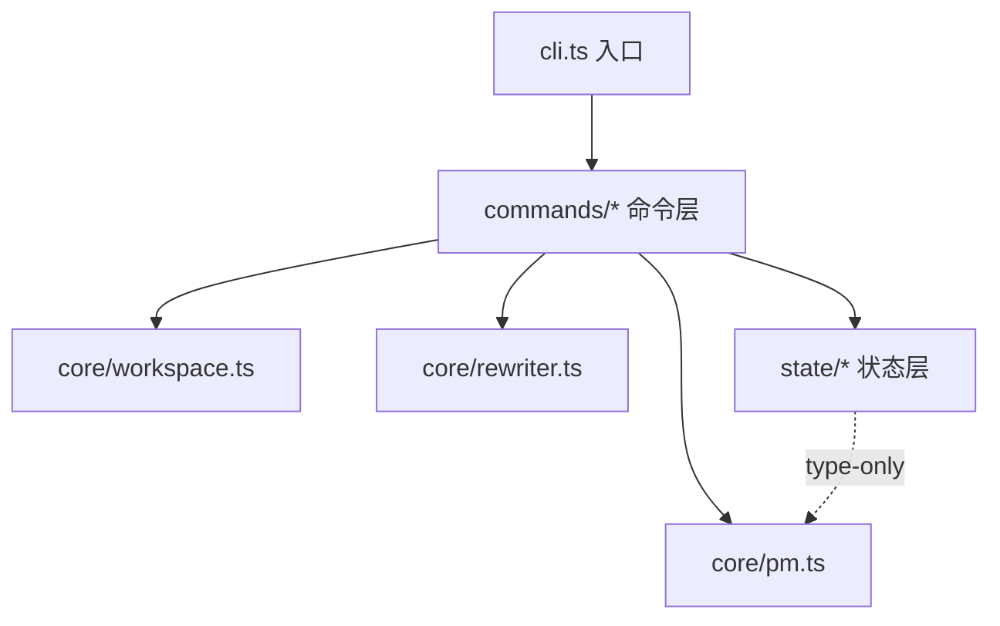

# S1 · CLI 脚手架 设计文档（spec）

- 日期：2026-09-25
- 状态：待评审（4 个开放决策点已拍板，见 §9）
- 路径归类：superpowers architectural（新项目首个子项目 spec）
- 上游：PRD（docs/prds/2026-09-25-lpm-v1-prd.md）多轮评审定稿 + SP0 实测（结论沉淀于 PRD §5/§15）；本 spec 引 PRD §14（选型定版）、§7（命令全集）、§9（文件与数据）
- 依赖：无（M1 首个 spec）

## 0. 流程注记与要素映射

- 位置与结构：按用户 2026-09-25 决策，spec 改用 superpowers 默认位置 `docs/superpowers/specs/YYYY-MM-DD-<topic>-design.md`、全按 superpowers 结构（问题 → 方案权衡 → 架构 → 组件 → 数据流 → 错误处理 → 测试）组织
- 实施流程：按用户决策改为**逐 spec 出 plan 实施**（评审通过 → writing-plans 出 implementation plan → executing-plans 实施），取代 PRD §14"全部 spec 定稿后写总 plan"
- Git：按用户全局规则，本文档不自动 commit
- PRD §14 约定的 spec 五要素在本文档中的映射：**目标 → §1；交付物 → §4.1；接口定义 → §4.2–4.5；测试清单 → §7.1–7.3；验收标准 → §7.4**

## 1. 问题与目标

**问题**：lpm v1 的全部后续工作（S2–S13）都要往同一个 CLI 工程里填代码。若不定工程结构与验证基建，每个 spec 都会各自引入构建 / 测试 / 出口约定，熵增不可控；S1 就是把这份"骨架契约"一次定死。

**目标**（交付可运行骨架，不含任何业务逻辑）：

1. **工程定型**：TypeScript（ESM，Node ≥ 22.12）+ commander + @clack/prompts + execa + tsup + vitest（PRD §14 定版，不重新选型；运行时依赖仅 commander / @clack/prompts / execa——PRD"lpm 自身要轻"）
2. **CLI 可跑**：`lpm --version` 从构建产物可运行，bin 接线完成（Windows 兼容）
3. **命令层骨架**：PRD §7 命令全集（11 个）全部注册并挂 help 元数据；未实现命令统一输出"计划 spec"提示
4. **业务模块骨架**：workspace 解析 / 改写引擎 / 状态层各自独立文件，数据契约与函数签名就位，实现为 stub
5. **验证基建**：typecheck / unit / e2e 三层，`pnpm verify` 一条命令全绿——后续所有 spec 复用

**非目标**（S1 明确不做）：

- 一切业务行为：PM 推断、清单解析 / glob、依赖命中、改写、状态文件真实读写、install 调用、交互流程
- **`--dry-run` 不注册占位**（已定，2026-09-25 评审）。理由：PRD §13.9 明言"dry-run 骗人比没有更糟"——无语义的占位 flag 会被误认为生效。该选项随首个带执行计划的命令（S6 link）引入，S12 统一校验全局一致性
- 未知命令模糊纠错增强（S12；commander 内建相似命令提示默认开启，保留即可）
- help 文案中文化与输出美化（S12）；CI / 发布流水线（按需后置）

**S1 完成后的约束**：后续 spec 只向骨架填充实现，不再调整工程结构（签名如需微调，见 §4.6 演进约定）。

## 2. 方案权衡

技术选型由 PRD §14 定版，本节记录**定版理由与被否选项**，供评审追溯，不重新开题。

| 决策点 | 定版 | 被否选项与理由 |
|---|---|---|
| 构建器 | tsup | vite：面向浏览器 dev server + HMR，lpm 是纯 Node 终端工具，无前端页面；esbuild 裸用：tsup 已封装 ESM/target/shebang/define 等细节；tsc 直出：多文件产物、bin/shebang 全手理 |
| 测试 | vitest | jest：ESM + TS 配置繁琐；node:test：断言与生态弱。vitest 与 tsup 同为 esbuild 内核，TS 直跑零配置 |
| CLI 框架 | commander（PRD 定版） | yargs / cac：收益不明显，PRD 已定版 |
| 依赖打包策略 | 依赖 external（tsup 对 dependencies 默认 external） | 全量 bundle 成单文件：仅无 node_modules 分发场景有收益，本工具全局安装时依赖随装；且 esbuild 打包含动态 require 的依赖（execa 等）易出事故 |
| 版本注入 | tsup/vitest `define` 同源注入（源 = package.json） | 运行时读 package.json：全局安装后路径解析脆弱；硬编码：双源漂移 |
| e2e 方式 | spawn `node dist/cli.js` | 经 PATH 全局命令：依赖安装状态；tsx 直跑 src：测的不是真实产物（shebang / define / external 全没验证） |

## 3. 架构



分层规则：

1. `commands/*` → 可依赖 `core/*` 与 `state/*`（命令是唯一编排层）
2. `core/*` 不依赖 `state/*`、`commands/*`；`state/*` 不依赖 `core/*`（运行时）；跨模块只允许 **type-only 引用**（如 state/types.ts 引 PackageManagerId）
3. core 内纯函数优先——rewriter 必须可 golden file 测试（S5 落实）

**入口模式**：`buildProgram()` 与 `run()` 分离 + `import.meta.url` 执行守卫（见 §4.5）——被 import（单测）时无副作用，直接执行时才启动。这是命令层可测性的关键接缝。

**层间数据流（预告，S1 只建接口不实现）**：cwd → findWorkspaceRoot → loadWorkspace → findDependents → rewriter 改写 → state 落盘 → PM install。本 spec 保证这条管线的每段都有独立文件与冻结签名。

## 4. 组件与接口

### 4.1 文件清单（交付物）

```
local-pack-manager/
├─ package.json            # bin / engines / scripts / deps
├─ tsconfig.json           # strict + NodeNext
├─ tsup.config.ts          # esm / node22 / shebang / 版本注入
├─ vitest.config.ts        # 版本注入与 tsup 同源
├─ .gitignore              # node_modules / dist
├─ docs/                   # 已有
└─ src/
   ├─ cli.ts               # 入口：buildProgram() 与 run() 分离（import.meta.url 守卫，保证可测）
   ├─ version.ts           # LPM_VERSION（tsup/vitest define 注入，唯一事实源 = package.json）
   ├─ env.d.ts             # __LPM_VERSION__ 全局类型声明
   ├─ commands/
   │  ├─ registry.ts       # 命令注册表：全部命令元数据（名称 / 中文 summary / 计划 spec）
   │  └─ stub.ts           # notImplemented() 统一 stub 行为
   ├─ core/
   │  ├─ pm.ts             # PackageManagerId 类型 + detectPackageManager 签名（S3 填充）
   │  ├─ globmatch.ts       # S2 新增：受限 glob 匹配器（纯函数，无 IO）
   │  ├─ workspace.ts      # 项目发现与 workspace 解析（S2 填充）
   │  └─ rewriter.ts       # 改写引擎 + 协议映射（S5 填充）
   └─ state/
      ├─ types.ts          # 四文件数据契约（S1 冻结，PRD §9 一一对应）
      └─ index.ts          # 读写 API 签名 + stub（S4 填充）
tests/
├─ unit/                   # vitest 直跑 TS，不起子进程
└─ e2e/                    # spawn node dist/cli.js，验证真实产物
```

> 注（已定，2026-09-25 评审）：保留 `core/pm.ts`——`PackageManagerId` 类型被 state（packageManager 字段）与 rewriter（协议映射入参）共同引用，独立成文件也是 S3 的自然落点。

**package.json**（版本号安装时取当前最新稳定版，spec 不锁小版本）：

```jsonc
{
  "name": "lpm",                    // 已定（2026-09-25 评审）：包名 lpm；将来发布若冲突再议 @seedhuang/lpm，bin 固定不变
  "version": "0.1.0",
  "type": "module",
  "engines": { "node": ">=22.12.0" },
  "bin": { "lpm": "dist/cli.js" },
  "scripts": {
    "build": "tsup",
    "dev": "tsup --watch",
    "typecheck": "tsc --noEmit",
    "test": "vitest run tests/unit",
    "test:e2e": "vitest run tests/e2e",   // 前置：先 build
    "verify": "pnpm typecheck && pnpm build && pnpm test && pnpm test:e2e"
  },
  "dependencies": {
    "commander": "<安装时最新稳定版>", "@clack/prompts": "<同左>", "execa": "<同左>"
  },
  "devDependencies": {
    "typescript": "<同左>", "tsup": "<同左>", "vitest": "<同左>", "@types/node": "<同左>"
  }
}
```

**tsup.config.ts**：

```ts
import { defineConfig } from 'tsup'
import { createRequire } from 'node:module'
const pkg = createRequire(import.meta.url)('./package.json')

export default defineConfig({
  entry: ['src/cli.ts'],
  format: ['esm'],
  target: 'node22',
  banner: { js: '#!/usr/bin/env node' },
  // Windows 全局安装由 npm/pnpm 生成 cmd shim（内部调 node），shebang 仍按惯例保留
  define: { __LPM_VERSION__: JSON.stringify(pkg.version) },
  sourcemap: true,
  clean: true,
  // commander/@clack/prompts/execa 属 dependencies，tsup 自动 external，不打进产物
})
```

**vitest.config.ts**：`define` 同样以 package.json 为源注入 `__LPM_VERSION__`（与 tsup 同源），`test.environment: 'node'`。

**tsconfig.json**：`strict`、`module: NodeNext`、`moduleResolution: NodeNext`、`target: ES2022`、`types: ["node"]`、`noEmit`（构建交给 tsup）。

**构建与运行链路**：`pnpm build` → 单入口 `dist/cli.js`，运行时依赖 external，产物轻；全局试用（可选、手动）`npm i -g .` 后任意目录运行 `lpm`；e2e 不依赖全局安装，直接 spawn `node dist/cli.js`。

### 4.2 数据契约（S1 冻结）—— src/state/types.ts

```ts
import type { PackageManagerId } from '../core/pm'

/** 项目级 lpm.config.json（进 git）—— PRD §9.1 */
export interface ProjectLpmConfig {
  version: 1
  packageManager?: PackageManagerId        // lpm use 显式设定后写入；未设定缺省
  libs: Record<string, string>             // lib 名 → 相对 workspace 根路径（正斜杠）
  presets?: Record<string, string[]>       // 预设名 → lib 名列表
}

/** 项目级 .lpm/state.json（gitignore）—— PRD §9.2 */
export interface LinkState {
  version: 1
  links: Record<string, {
    original: Record<string, string>       // "<相对根>/package.json" → 原 range
    linkedAt: string                       // ISO 8601
  }>
}

/** 项目级 .lpm/last.json（gitignore）—— PRD §9.3 */
export interface LastSet { version: 1; names: string[] }

/** 用户级 ~/.lpm/config.json —— PRD §9.4 */
export interface UserLpmConfig { version: 1; scanDirs: string[] }   // 绝对路径
```

### 4.3 core 模块签名（S1 冻结签名，实现为 stub）

以下所有 stub 的函数体统一为 `throw new Error('not implemented: <函数名>（计划 S<x>）')`——本节交付的是类型、签名与行为契约；领域错误类型（如 WorkspaceNotFound）由各实现 spec 自行引入，S1 不预建错误体系。

**core/pm.ts**（S3 已填充；新增导出 detectPackageManagerDetailed / resolvePackageManager / subdivideYarn / PMAmbiguousError / PMUnresolvedError 与类型 PMEvidence / DetectResult / PMResolution，见 S3 spec §4.3）：

```ts
export type PackageManagerId = 'pnpm' | 'npm' | 'yarn-classic' | 'yarn-berry'
// 推断优先级（lockfile > packageManager 字段 > workspace 清单）与 berry/classic 判定见 PRD §7，S3 实现
export async function detectPackageManager(rootDir: string): Promise<PackageManagerId>  // S3 已实现（detectPackageManagerDetailed 的单行包装）
```

**core/workspace.ts**（S2 填充）：

```ts
export interface PackageJsonInfo {
  dir: string            // 包目录绝对路径
  manifestPath: string   // package.json 绝对路径
  name: string           // 包 name（缺失时为空串）
  isRoot: boolean
}

export interface Workspace {
  rootDir: string
  manifestFormat: 'pnpm-workspace' | 'package-json' | 'single'   // single = 非 monorepo
  members: PackageJsonInfo[]                                     // 含根自身
}

/** 从 startDir 向上探测：
 *  遇 pnpm-workspace.yaml 或含 workspaces 字段的 package.json → 即 workspace 根；
 *  否则第一个含 package.json 的目录即根（单包项目）；
 *  至盘根未命中 → 抛 WorkspaceNotFound（提示"请在项目目录内运行"） */
export async function findWorkspaceRoot(startDir: string): Promise<string>   // stub

/** 清单解析 + glob 展开成员（含排除），PRD §14-S2 */
export async function loadWorkspace(rootDir: string): Promise<Workspace>     // stub

export interface DepHit {
  manifestPath: string
  section: 'dependencies' | 'devDependencies' | 'optionalDependencies'
  currentValue: string    // 当前 range 字面值
}

/** 扫描全部成员（含根）三类依赖位，返回声明了 pkgName 的命中；
 *  peerDependencies 不进命中（仅警告，S5/S6 处理） */
export async function findDependents(ws: Workspace, pkgName: string): Promise<DepHit[]>   // stub
```

**core/rewriter.ts**（S5 填充）：

```ts
import type { PackageManagerId } from './pm'

export type Protocol = 'link' | 'portal' | 'file'

/** PRD §5 协议映射：pnpm | yarn-classic → link:，yarn-berry → portal:，npm → file:；
 *  返回完整依赖值（协议前缀 + 相对路径），相对路径基于 manifest 所在目录换算，
 *  正斜杠，永不输出绝对路径 */
export function mapProtocol(pm: PackageManagerId, libDirAbs: string, manifestDirAbs: string): string   // stub

export interface RewriteResult {
  content: string          // 改写后全文
  changedKeys: string[]    // "段名.包名"
  unchangedKeys: string[]  // 值已等于目标（幂等命中）
}

/** 文本级替换（PRD §9）：保持缩进 / key 顺序 / 尾随换行 / CRLF-LF / BOM；
 *  仅动命中行的 value；命中段：dependencies / devDependencies / optionalDependencies */
export function rewriteDepValue(manifestSource: string, pkgName: string, targetValue: string): RewriteResult   // stub

/** unlink 恢复原 range，格式保持语义同上 */
export function restoreDepValue(manifestSource: string, pkgName: string, originalRange: string): RewriteResult   // stub
```

> S2 落地回写（S1 §4.6 演进约定）：`core/globmatch.ts` 新增导出 `matchWorkspacePattern`；`core/workspace.ts` 新增导出 3 个错误类 `WorkspaceNotFoundError` / `ManifestParseError` / `WorkspacePatternError`。冻结签名与数据契约未改动。

### 4.4 state 读写 API（S4 填充；readProjectConfig/writeProjectConfig 已由 S3 提前实现，含原子写 helper src/state/atomic.ts 与 LpmConfigParseError）—— src/state/index.ts

```ts
// 全部写入为原子写：临时文件 + rename（PRD §9 崩溃安全，防双终端并发写坏）
export async function readProjectConfig(rootDir: string): Promise<ProjectLpmConfig | null>   // null = 未初始化；S3 提前实现
export async function writeProjectConfig(rootDir: string, cfg: ProjectLpmConfig): Promise<void>   // S3 提前实现（原子写）
export async function readState(rootDir: string): Promise<LinkState | null>
export async function writeState(rootDir: string, st: LinkState): Promise<void>
export async function deleteState(rootDir: string): Promise<void>   // links 清空即删文件（兼作 web 片段开关信号）
export async function readLast(rootDir: string): Promise<LastSet | null>
export async function writeLast(rootDir: string, last: LastSet): Promise<void>
export async function readUserConfig(): Promise<UserLpmConfig>      // 文件缺失 → { version: 1, scanDirs: [] }
export async function writeUserConfig(cfg: UserLpmConfig): Promise<void>

/** 首次创建 .lpm/ 时检查 .gitignore 是否覆盖 .lpm/，未覆盖则追加并告知（PRD §9.5） */
export async function ensureGitignoreEntry(rootDir: string): Promise<'present' | 'added'>   // stub
```

### 4.5 命令层（S1 交付主体）

**命令注册表** registry.ts（唯一事实源，测试据此断言）：

```ts
export interface CommandMeta {
  name: string
  summary: string        // help 一句话中文描述
  plannedSpec: string    // stub 提示用
}
export const COMMANDS: CommandMeta[] = [
  { name: 'use',     summary: '设定或自动推断包管理器',     plannedSpec: 'S3' },
  { name: 'link',    summary: '把依赖切到本地目录联调',     plannedSpec: 'S6' },
  { name: 'unlink',  summary: '恢复 registry 版本',        plannedSpec: 'S7' },
  { name: 'status',  summary: '三方核对链接状态',           plannedSpec: 'S8' },
  { name: 'repair',  summary: '修复漂移与孤儿状态',         plannedSpec: 'S8' },
  { name: 'save',    summary: '当前链接集存为预设',         plannedSpec: 'S10' },
  { name: 'preset',  summary: '预设管理',                  plannedSpec: 'S10' },
  { name: 'forget',  summary: '移除 lib 注册',              plannedSpec: 'S11' },
  { name: 'dir',     summary: '用户级扫描目录管理',         plannedSpec: 'S11' },
  { name: 'init',    summary: '注入 web 自感知配置片段',     plannedSpec: 'S13' },
  { name: 'uninit',  summary: '摘除 web 自感知配置片段',     plannedSpec: 'S13' },
]
```

**入口模式** cli.ts：

```ts
export function buildProgram(): Command                    // 组装 + 注册（可单测）
export async function run(argv: string[]): Promise<number> // parseAsync，返回退出码

// 直接执行时才 run()，被 import（测试）时不执行；
// 两侧 realpath 归一，防 Windows 路径大小写差异
if (process.argv[1] && import.meta.url === pathToFileURL(realpathSync(process.argv[1])).href) {
  process.exitCode = await run(process.argv.slice(2))
}
```

**stub 行为** stub.ts：

```ts
export function notImplemented(meta: CommandMeta): void {
  // 只提示，不设退出码（退出码契约见 §6：stub 统一 0）
  process.stderr.write(`lpm ${meta.name} 尚未实现（计划 ${meta.plannedSpec}）。当前可用：lpm --help\n`)
}
```

**S1 行为契约**：

| 输入 | stdout | stderr | 退出码 |
|---|---|---|---|
| `lpm --version` | 纯 semver（如 `0.1.0`），无前后缀，便于脚本解析 | — | 0 |
| `lpm`（无参数）/ `lpm --help` | help：命令名 + summary + 计划 spec 注记 | — | 0 |
| `lpm <已注册命令> ...` | — | `lpm <命令> 尚未实现（计划 <spec>）。当前可用：lpm --help` | 0（stub 契约，见 §6） |
| `lpm <未知命令>` | — | commander 默认错误（内建相似命令提示保留，打磨在 S12） | 1（commander 默认） |

> 注（S3 回写）：`lpm use` 已实现为真实命令（行为契约见 S3 spec §4.5），上表"已注册命令 → stub"行对 use 不再适用；其余命令仍走 stub 契约。

选项注册：S1 仅 commander 内建 `--version` / `--help`；各命令参数与选项（`--watch` / `--all` / `--last` / `preset rm` 子命令等）随各自 spec 注册。

### 4.6 接口演进约定

- S1 冻结：模块边界、数据契约（§4.2）、命令名单、退出码契约
- 允许演进：函数签名细节可由 S2–S5 spec 按实现需要微调，但须同步回改本文档对应小节（保持 spec 与代码一致），并在该 spec 中注明

## 5. 数据流

S1 无业务数据流，三条骨架数据流：

1. **版本同源流**：`package.json.version` →（build）tsup `define` 注入 → `dist/cli.js --version` 输出；同源 →（test）vitest `define` 注入 → unit/e2e 断言与 package.json 一致。单一事实源，双构建路径不可能漂移
2. **命令调用流**：argv → `run()` → commander parse → registry 命中 → handler（S1 全为 stub：stderr 中文提示，退出码保持 0）；未命中 → commander 默认错误；`--version` / `--help` / 无参数 → help 输出
3. **业务管线（预告，仅接口）**：cwd → findWorkspaceRoot → loadWorkspace → findDependents → rewriter → state → PM install——每段独立文件、签名冻结（§4.3–4.4），S2–S6 逐段填充

## 6. 错误处理

- **退出码契约**（2026-09-25 评审定）：0 = 正常结束（help / version / stub 命令）；1 = 未知命令（未来运行期错误也先用 1，细分错误码留 S12 全局打磨时定）。stub 退出 0 的已知后果：脚本无法凭退出码区分"执行成功"与"尚未实现"，需以 stderr 提示为准——stub 为临时态（各命令 spec 逐个替换为真实现），影响期有限
- **用 `process.exitCode` 而非 `process.exit`**：后者会截断尚未 flush 的 stdout/stderr（管道场景），前者让进程自然退出
- **not-implemented 提示统一走 registry 的 plannedSpec 字段**生成（§4.5 stub.ts），杜绝文案与 spec 编号漂移；文案中文，与 PRD"文案全中文"一致
- **领域错误体系延后**：WorkspaceNotFound 等由各实现 spec 自行引入，S1 不预建
- **逃生门原则（PRD §11）S1 不涉及**：S1 无任何状态写入

## 7. 测试与验收

### 7.1 分层

- **unit**（tests/unit/）：vitest 直跑 TS，不起子进程
- **e2e**（tests/e2e/）：spawn `node dist/cli.js`——验证真实产物（shebang / define 注入 / 依赖 external 后可运行）；前置 `pnpm build`，dist 缺失时报错并提示先 build，**不允许静默跳过**

### 7.2 unit 清单

| 文件 | 用例 | 断言 |
|---|---|---|
| version.test.ts | 版本同源 | `LPM_VERSION === package.json.version` 且匹配 `/^\d+\.\d+\.\d+/` |
| registry.test.ts | 命令全集覆盖 | `COMMANDS` 名称集合 === PRD §7 全集 11 个（use/link/unlink/status/repair/save/preset/forget/dir/init/uninit），无重复；每项含 summary 与 plannedSpec |
| program.test.ts | program 组装 | `buildProgram()` 注册的命令名单与 COMMANDS 一致；含 `--version` 选项 |
| stub.test.ts | stub 行为 | 任取 2 个命令 handler 执行：handler 不设非零退出码（`process.exitCode ?? 0 === 0`），stderr 含"尚未实现"与 plannedSpec |
| state-stub.test.ts | stub 可 rejected | 抽样 readState / readProjectConfig：reject 且 message 符合 not-implemented 约定 |

### 7.3 e2e 清单（spawn `node dist/cli.js`，工作目录用临时目录）

| 用例 | 断言 |
|---|---|
| `--version` | exit 0；stdout === package.json.version（纯 semver） |
| `--help` | exit 0；stdout 含全部 11 个命令名 |
| 无参数 | exit 0；stdout 含 help / Usage |
| `lpm status`（stub） | exit 0；stderr 含 S8 |
| `lpm lnik`（未知命令） | exit ≠ 0；stderr 非空 |

### 7.4 验收标准

1. 全新 clone → `pnpm install` → `pnpm verify` 一条命令全绿（typecheck / build / unit / e2e），本机 Windows 通过
2. `node dist/cli.js --version` 输出与 package.json.version 一致的纯 semver
3. `lpm --help` 列出 PRD §7 全部 11 个命令与中文 summary；stub 命令按 §4.5 契约输出计划 spec 提示
4. 模块骨架齐备：§4.1 文件全部就位，导出与 §4 接口一致；依赖方向符合 §3 规则（评审检查）
5. 依赖约束：dependencies 恰为 commander / @clack/prompts / execa；devDependencies 仅 typescript / tsup / vitest / @types/node（@clack/prompts 在 S9 前未使用属预期）
6. （手动，可选）`npm i -g .` 后任意目录 `lpm --version` 可用

## 8. 后续衔接

| 模块 | 填充 spec |
|---|---|
| core/workspace.ts | S2 项目发现与 workspace 解析 |
| core/pm.ts | S3 PM 检测与 use |
| state/* | S4 配置与状态文件层 |
| core/rewriter.ts | S5 改写引擎 |
| commands/* | S6 起 stub → 实现；交互 S9；打磨 S12 |

本 spec 评审通过后：invoke **writing-plans** 出 S1 implementation plan → executing-plans + TDD 实施（逐 spec 循环，用户已定）。

## 9. 决策记录（2026-09-25 评审拍板）

1. 包名：`lpm`（将来发布若冲突再议 `@seedhuang/lpm`，bin 固定 `lpm`）
2. `core/pm.ts`：保留（类型共用 + S3 落点，见 §4.1 注）
3. stub 退出码：统一 0，stderr 中文提示保留（§4.5 / §6 已同步）
4. `--dry-run`：不注册占位，随 S6 首个带执行计划的命令引入（§1 非目标）
