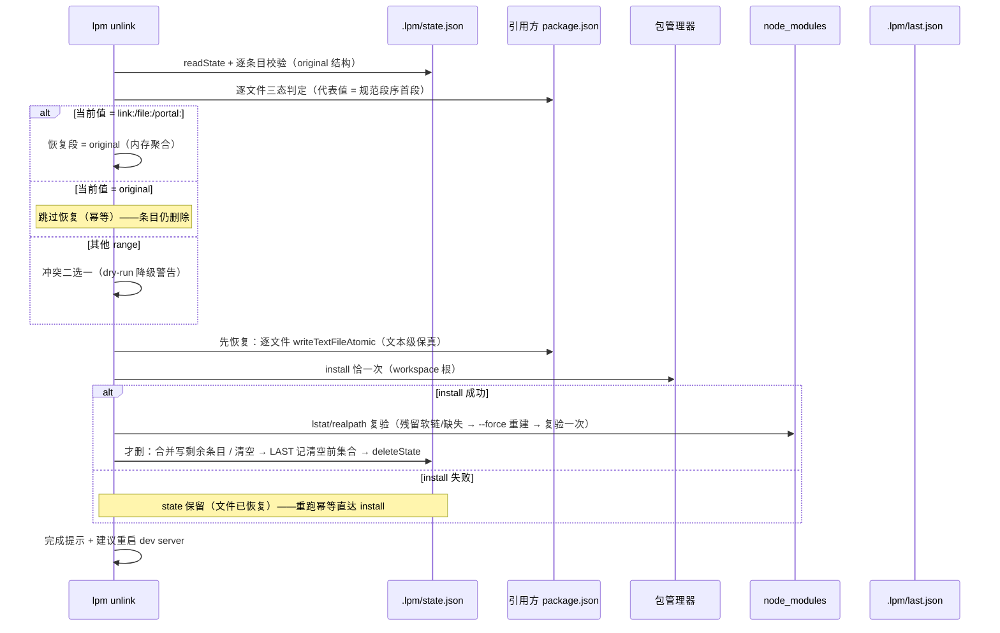

# S7 unlink 直通版 设计 spec

> 状态：待用户终审（通过前不动代码——PRD §14 行 395）
> 落盘：2026-09-27。BASE：7d38504（S6 已提交；工作树干净）
> 权威来源：PRD docs/prds/2026-09-25-lpm-v1-prd.md §6.2 / §7 / §9 / §10 / §11 / §14 行 406 / 附录 A 行 468；S6 spec（行为先例与消费契约）
> 流程：S1–S6 惯例——本 spec 用户终审通过 → writing-plans → SDD 逐任务实施

## 1. 目标与非目标

### 目标

`lpm unlink <名字|路径>... [--all] [--dry-run]` 全链路直通：

1. **三态恢复**（PRD §10 行 330–335，per-file 粒度）：`link:/file:/portal:` → 恢复 original；`= original` → 跳过（幂等）；其他 range → 停下展示差异二选一（防 B1：覆盖手动升级的 range）
2. **幂等**：install 失败后重跑 `lpm unlink` 恢复段全部三态跳过、直达 install 重试（PRD §6.2 行 143）
3. **崩溃安全顺序**（PRD §9 行 306 unlink 侧定版）：**先恢复文件 → install 成功 → 才删 state**（links 清空则删 state 文件 + last 记清空前完整集合）
4. **lstat 复验 + `--force` 重建**（brainstorming 定版入 S7；PRD §10 行 324 + §11 行 361）：install 后验证 node_modules 实际指向，残留软链/缺失时 `--force` 重建；Windows junction 兼容（realpath 比对，PRD 行 328）
5. **`--all`**（brainstorming 定版入 S7）：清空全部链接 → 拆至清空链路（删 state 文件 + last 记清空前完整集合，PRD §10 行 344）
6. **`--dry-run`**：复用 S6 §4.4 K 契约（零写盘零子进程 + 执行计划）
7. 条目级 state 防御落地（S4 spec §8 行 270 归 S7）；E6a 单值边界收敛（S6 spec §9 自决 3 归 S7）
8. S6 遗留顺手项：link-command 测试 3 it 补缺（S6 final-review N-7/M-4）

### 非目标

- 无参数交互模式（S9）；`--last` / `--preset` 恢复操作（S10）；status/repair（S8）；forget/注册管理（S11）
- status 三方核对**矩阵判定**（S8）——S7 仅做 unlink 自身的 install 后复验（brainstorming 第 1 问定版边界）
- state 并发写保护（同 S6 §9 候选 9：触发信号出现再评估）
- 真实 yarn/npm 全链自动化（PRD §12 smoke 归用户手测；沿用 S6 口径）

## 2. 关键裁决（brainstorming 2026-09-27 拍板，7 问全收敛）

| # | 裁决 | 定版 |
|---|---|---|
| 1 | lstat 复验 + `--force` 重建分期 | **入 S7**（PRD 字面场景即 unlink）；S8 只承接三方核对矩阵判定；Windows junction 兼容（realpath 比对）随复验一并落地 |
| 2 | `--all` 与 last 集合记录 | **入 S7**（PRD §7 命令面字面 + last 表是 unlink 行为本体）；`--last/--preset` 恢复归 S10 |
| 3 | 三态判定粒度 | **per-file**（state.original 键即 manifestPath；PRD 行 335 文件级处置字面）；单文件冲突不阻塞其他文件 |
| 4 | E6a 单值边界恢复形态 | **全段写回首个命中 original + 警告**（分段原值信息 link 落盘时已丢失，S4 schema 限制下唯一可行；不扩 schema version） |
| 5 | 条目级 state 损坏 | **读时校验 + 报错 exit 1**（遇错即停，对齐 S6 惯例；文案指向逃生门三步——不静默吞） |
| 6 | dry-run 遇冲突文件 | **S6 K 同构 + 降级警告继续**（对齐 S6 E4 dry-run 降级先例；保留全量预览能力） |
| 7 | install 失败文案 link/unlink 共存 | **runInstall 可选参数 retryAdvice**（默认 = 现 link 向文案，link 调用零改动；unlink 传 unlink 向文案——重跑语义相反且真实有效） |

## 3. 数据流



## 4. 接口与行为契约

### 4.1 命令面（PRD §7 行 261）

```
lpm unlink <名字|路径>... [--all] [--dry-run]
```

- 无参数且无 `--all` → exit 1（镜像 S6 §9 自决 4：「交互模式随 S9 上线；直通用法：lpm unlink <名字|路径>... [--all] [--dry-run]」）
- `--all` 与显式 targets 互斥 → LinkArgumentError
- description 不带「（计划 S7）」后缀（S3/S6 接线惯例）

### 4.2 分层与文件（S1 分层表不变）

| 文件 | 变更 |
|---|---|
| src/commands/unlink.ts | **新增**：编排全链（唯一命令编排层） |
| src/core/rewriter.ts | **新增 2 导出**：readDepValues、LOCAL_PROTOCOL_RE（§4.3）；既有 7 导出零改动 |
| src/core/install.ts | runInstall 加可选参数 retryAdvice（§4.3）；**新增 2 导出**：buildForceInstallCommand、buildForceInstallCommandLine |
| src/commands/link.ts | 内部实现一处：LOCAL_PROTOCOL_RE 改为 import rewriter 导出（私有 const 删除；公共 API 零变化，不违 S6 冻结面——P1-2 正则单源） |
| src/state/index.ts | **零改动**（deleteState/readLast/writeLast 已就位——S4 spec §8 行 270 的「嵌套防御」在 unlink.ts 读时落地，不扩 state 层） |
| src/cli.ts | unlink 特判接线（镜像 link 分支） |
| tests/unit/unlink-command.test.ts、install.test.ts、rewriter.test.ts、link-command.test.ts（顺手 3 it）、tests/e2e/cli.e2e.test.ts | 测试 |

### 4.3 公共 API 面

**冻结面零改动**：S1 §4.3/§4.4、S3 §4.3、S5 rewriter 7 导出、S6 §4.3 所列公共 API 的既有签名不变。新增导出按「公共 API 冻结面约定」：

```ts
// ── src/commands/unlink.ts（全部新增）──
export class LinkStateCorruptError extends Error {
  constructor(public key: string, message: string)
  // 条目级损坏：original 缺失/非对象/值非字符串/值空串/空对象——文案含逃生门三步指向（§5 #4）
}

export interface UnlinkOptions {
  all?: boolean
  dryRun?: boolean
}

export async function runUnlink(
  targets: readonly string[],
  opts: UnlinkOptions,
  cwd: string = process.cwd(),
): Promise<number>  // 0 成功 / 1 业务失败；reportError 单通道镜像 link.ts（KNOWN 列表并入 LinkStateCorruptError）

// ── src/core/rewriter.ts（新增 2；scanManifest 复用，规范段序输出）──
export function readDepValues(
  manifestSource: string,
  pkgName: string,
): Array<{ section: string; value: string }>
// dependencies → devDependencies → optionalDependencies 段序；peerDependencies 不在读取面
// （link 未改 peer，unlink 恢复不碰——S6 既定约束）

/** 本地协议判定单源（P1-2：link.ts 私有 const 提升为共享导出，unlink 态 1 判定复用——协议清单防漂移） */
export const LOCAL_PROTOCOL_RE: RegExp   // /^(link|file|portal):/（link.ts 既有字面原样提升）

// ── src/core/install.ts ──
export async function runInstall(
  rootDir: string,
  pm: PackageManagerId,
  retryAdvice?: string,   // 可选；缺省 = 现 link 向文案（S6 #16 修正版）——既有调用零改动
): Promise<void>
export function buildForceInstallCommand(pm: PackageManagerId): readonly string[]
// pnpm: ['install','--force'] / npm: ['install','--force'] / yarn-classic: ['install','--force']
// yarn-berry: ['install','--force']（不带 --immutable——与 force 语义互斥）
export function buildForceInstallCommandLine(pm: PackageManagerId): string
// 展示串：`<可执行名> install --force`（PM_BINARY 单源——OCR O1 教训）
```

**签名扩展声明**：runInstall 可选第三参 = 既有签名兼容扩展（S6 spec §4.3 行 153 回写注记，见 §6 回写义务）。

### 4.4 行为契约

#### A. workspace 与解析（镜像 S6 A5）

`findWorkspaceRoot(cwd)` → `loadWorkspace(rootDir)` → `resolvePackageManager(rootDir, cfg?.packageManager)`（PM 检测提示行镜像）；state 预读 `readState(rootDir)`。

#### B. target 解析与 key 推导

1. **名字分支**：key = target；不读 lib 目录（**unlink 不跑 checkLib**——lib 可能已删/移动，这正是 unlink 用途之一）
2. **路径分支**：目录必须存在（否则 LinkArgumentError「路径不存在」）——镜像 S6 解析链 resolveTarget（已注册 → 注册 key）→ resolveMonorepo（B4 让选镜像：成员唯一直接选；多成员非 TTY 报错，S6 §4.4 B3）→ key = manifest name ≠ '' ? name : toRel(rootDir, libDirAbs)（§9 自决 7 镜像）
3. state.links 无 key → `未链接：${key}，跳过`（幂等对称——link 对已链接跳过，unlink 对未链接跳过；planSkipped 镜像）
4. 同 key 去重（seenKey/seenRaw + dedupSkipped 计数）镜像 S6 E5

#### C. 条目校验（裁决 5）

逐 target 取 `entry = st.links[key]`，校验 entry 存在且 `original` 为「对象、非空、键值全 string 且值非空串」；失败 → `LinkStateCorruptError(key, ...)`，exit 1 遇错即停。文案基线：

```
state 条目损坏：<key> 的 original <缺失/类型错>。手工逃生三步：① git checkout -- <受影响>/package.json ② 删除 .lpm/ ③ 在 workspace 根重跑一次 install——lpm 状态可抛弃重建
```

文件级坏 JSON 由 S4 readState → LpmStateParseError 透传（文案已含逃生门指向）。

#### D. 逐文件三态判定（裁决 3 per-file；裁决 4 全段写回）

对 entry.original 的每个键（`'<相对根>/package.json'`，根命中 `'package.json'`，G1 镜像）：

1. 文件不存在 → `跳过（文件不存在）：<rel>` + 警告，该文件出局（PRD 行 335）；**key 的全部文件均不存在 → 该 key 条目保留**（保守：original 数据存续，S8 repair 可收敛），无恢复动作不触发 install。键格式损坏（绝对路径/反斜杠等）不在此列校验——join 后文件**不存在或不是常规文件**（如 `''`→workspace 根、`'apps/web'`→目录）自然落入本条警告兜底（rel 可见可修，P2-6 口径；OCR 评审轮补「非常规文件」判据——缺此判据时 `readFileSync` 抛 EISDIR 且不在 KNOWN 错误表内，会逃逸出 runUnlink）
2. 读文件文本（readFileSync utf8）→ `readDepValues(source, key)` 取命中段
3. **文件代表值 = 规范段序首个命中段当前值**（与 link 侧 original 记首个命中值镜像对称）；三态判定用代表值：
   - 代表值匹配本地协议（LOCAL_PROTOCOL_RE，rewriter 单源——P1-2）→ **恢复**：restoreDepValue(source, key, original)（全段写回——裁决 4）
   - 代表值 === original → **幂等跳过**（零改写；该 key 条目仍进入删除面——见 G1，保证重跑收敛）
   - **文件内无命中段**（依赖已被手动移除）→ 视为幂等跳过（零改写，文件所在 key 照常进待删集）（计划期修订 2）
   - 其他 range → **冲突二选一**（交互）：clack.select「用当前 <当前值>（保留手动升级）」/「用 original <original>（恢复）」；isCancel → 放弃该 lib（条目保留，planAbandoned 镜像）；非 TTY → LinkInteractionError('conflict-ternary')；**dry-run → 降级警告继续**（裁决 6）
4. 文件内 ≥2 段命中且段值不全等 → 警告：`<rel> 多段命中值异，全段写回 <original>`（裁决 4 文案定版）
5. 同文件多 target（多 lib）链式恢复：aggregated content 内存演化，每文件恰一次 restoreDepValue per lib、恰一次写盘（S6 E5/O7 镜像）

#### E. 恢复写盘——崩溃安全顺序（PRD §9 行 306；聚合完成前遇错即停，零写盘——S6 遇错即停语义镜像）

执行顺序定版：**E1 恢复文件 → E2 install → F 复验/--force → G 删 state**。

1. **先恢复文件**：逐文件 `writeTextFileAtomic(manifestPath, finalContent)`（文本级保真：BOM/CRLF/缩进零破坏——S6 §8 衔接表消费契约）
2. **install 恰一次**（workspace 根；**触发条件 = 待删集非空**（G1）——覆盖恢复/幂等跳过/冲突选「用当前」三类 key：恢复需装回、幂等跳过需补齐上次可能未生效的 install（重跑直达重试）、用当前需让 node_modules 对齐手动 range）：`runInstall(rootDir, pm, UNLINK_RETRY_ADVICE)`
   - `UNLINK_RETRY_ADVICE`（裁决 7）：「state 已保留（文件已恢复），可直接重跑 lpm unlink——恢复段幂等跳过直达 install；若需彻底重来：① git checkout -- <受影响>/package.json ② 删除 .lpm/ ③ 在 workspace 根重跑一次 install——lpm 状态可抛弃重建」（install 命令行展示走 buildInstallCommandLine 单源）
   - install 失败 → InstallError 抛出 → **state 未删**（顺序保证），重跑幂等
3. **install 成功 → 才删 state**（G 节）

#### F. lstat 复验 + `--force` 重建（裁决 1；PRD 行 324/326/328）

install 成功后，对**待删集 keys 的 entry.original 全部 manifest 目录** × 该 key（复验面 = 待删集而非「有恢复动作」——幂等跳过 key 的重跑场景残留同样需检；包名 = key——有 original 条目 ⇒ lib 有 name ⇒ 注册名/name 即包名；路径分支空名例外无条目）（原始键指向的文件不存在时不入复验面——与 D1「文件不存在 → 该文件出局」对齐；该目录无 node_modules 可检）：

1. 复验对象：`<manifestDir>/node_modules/<key>`
2. 判定（**realpath 比对**——兼容 symlink 与 junction，PRD 行 328；lib 可能已删/链接可能悬空，全部 try/catch）：
   - 条目不存在 → **缺失** → `--force` 重建
   - `realpathSync(nmEntry)` 抛错（**悬空链接**——registry 实体不可能悬空）→ **残留** → `--force` 重建
   - realpath 成功且 === `realpathSync(libDirAbs)`（libDirAbs = join(rootDir, cfg.libs[key])，两侧均可解析时比对）→ **软链残留** → `--force` 重建
   - libDirAbs 不可解析（cfg.libs 无该 key 或 lib 目录已删）→ 无法比对指向：悬空/缺失照常判定，**指向比对跳过 + 注明「注册缺失/库已删，无法比对指向」**
   - 其余（registry 实体等）→ 通过
3. `--force` 重建：`execa(PM_BINARY[pm], buildForceInstallCommand(pm), { cwd: rootDir, stdio: ['inherit','inherit','pipe'] })` 恰一次（多文件多 key 聚合后单次）；失败 → InstallError（retryAdvice 同 E2——**--force 发生在删 state 之前**，失败 → state 保留 + 幂等重跑）
4. 重建后**复验恰一次**：仍残留/缺失 → 警告（不重试、不阻塞——`警告：node_modules 复验未通过：<rel>/node_modules/<key>（<残留/缺失>）；lpm status（S8）可进一步诊断`）；通过 → 提示 `已重建：<...>`
5. 待删集为空（无 install）→ 复验整段跳过

#### G. state 删除与 last（裁决 2；PRD §10 行 337–344）

1. **待删集** = 本次「非放弃且条目校验通过」的 keys（含幂等跳过 key——重跑收敛闭环，D3；含冲突选「用当前」key——手动 range 接管后 original 条目使命终结；不含全文件缺失 key——条目保留，自决 5）
2. **合并写**：剩余条目 writeState（read-modify-write 镜像 S6 E6a）
3. **拆至清空**（操作后 links 为空——无论 `--all` 还是显式 targets 删光）：先算 `清空前完整集合 = 操作前 st.links 全部 keys` → **先 writeLast（记清空前集合）→ 后 deleteState**（rmSync force 幂等——只删 state.json 不动 last/.lpm/）。顺序论证（OCR 评审 P1）：反序时「deleteState 成功 / writeLast 前崩溃」= state 与 last 双双落空，清空前集合**永久丢失**（无兜底重建路径）；正序时崩溃窗口落在「last 已记 + state 尚在」→ 重跑按幂等链收敛（态2 跳过 → install → 再删 state，last 重写同集合）→ 最终一致
4. 未清空 → last 不动（PRD last 表行 343：unlink 单个不动）
5. `--all` 且 state 空/无 links → `无已链接项` exit 0（幂等，不报错）
6. `--all` 无确认的论证（P2-7）：破坏面 = lpm 自身可抛弃状态文件（逃生门原则 PRD 行 364）；package.json 恢复动作已受 D3 冲突确认保护，恢复后 git diff 可比对——不设二次确认，S9 交互层再升级

#### H. `--dry-run`（裁决 6；镜像 S6 §4.4 K）

```
dry-run 执行计划（不落任何盘、不执行任何子进程）：
  恢复 <相对根>/package.json:
    dependencies.<pkg>：<当前值> → <original>
  已恢复跳过：<key>（<rel> 值已等于 original）        ← 幂等命中逐行
  未链接跳过：<key>                                   ← state 无条目
  冲突需确认：<rel>（当前 <值> vs original <值>）      ← 降级警告，真实执行时将询问
  文件不存在警告：<rel>                               ← 逐行
  state：删除 <key>（剩余 N 条）/ 清空：last 记 <集合> → 删 state 文件
  install：<可执行名> install <flags>（workspace 根）   ← 待删集非空时
  复验：node_modules 实际指向（残留/缺失将 <可执行名> install --force 重建）
```

零副作用硬约束同 S6 K2（config/state/pkg/last/.gitignore 零写、零子进程）；计划体为空 → 「无待执行变更」；--dry-run 不触发 install/复验/--force。

#### I. 完成提示（O4 镜像 + PRD 行 145）

```
恢复完成：N 个 lib，M 处声明恢复：
  <rel>:
    <section>.<pkg>：<link 值> → <original>
以上 package.json 已恢复原 range（多数场景与 git 基线一致；冲突选「用当前」的文件保留手动改动）；建议重启 dev server 使依赖变更生效。
```

复验/重建/--force 结果逐行附注；放弃/文件缺失警告在前序步骤已输出。

#### J. 计数与汇总（J2 镜像）

`恢复完成` 头部计数 = 恢复段 changedKeys 总和 M、lib 数 N（去重后）；跳过分类逐行（已恢复跳过 / 未链接跳过 / 放弃 / 文件缺失），去重跳过计入总跳过。

#### K. cli.ts 接线（L 镜像）

```ts
if (meta.name === 'unlink') {
  program.command(meta.name).description(meta.summary)
    .argument('[targets...]', '注册名或路径')
    .option('--all', '取消全部已链接依赖')
    .option('--dry-run', '仅打印执行计划，不落盘不执行')
    .action(async (targets, options: { all?: boolean; dryRun?: boolean }) => {
      process.exitCode = await runUnlink(targets, options)
    })
  continue
}
```

## 5. 错误表（§6 编号续 S6；全部 stderr 单通道 reportError）

| # | 错误类 | 触发 | 文案基线 | exit |
|---|---|---|---|---|
| 1–2 | WorkspaceNotFoundError / WorkspacePatternError | 透传 S2 | 原文案 | 1 |
| 3 | LinkArgumentError | 无参数无 --all / --all 与 targets 互斥 / 路径不存在 | 「交互模式随 S9 上线；直通用法：lpm unlink <名字\|路径>... [--all] [--dry-run]」/「--all 与显式目标互斥」/「路径不存在或不是目录：<p>」 | 1 |
| 4 | **LinkStateCorruptError（新）** | 条目级损坏（C 节） | 「state 条目损坏：<key> 的 original <病因>。手工逃生三步：① git checkout -- <受影响>/package.json ② 删除 .lpm/ ③ 在 workspace 根重跑一次 install——lpm 状态可抛弃重建」 | 1 |
| 5 | LinkInteractionError: conflict-ternary | 冲突二选一非 TTY | 「检测到手动改动（<rel>：当前 <当前值> vs original <original>），需交互确认。请手动处理该文件后重试，或先 lpm unlink --dry-run 查看」 | 1 |
| 6 | LinkInteractionError: member-select | B4 让选非 TTY | 镜像 S6 #13 | 1 |
| 7 | InstallError | runInstall / --force 失败 | message 由 retryAdvice 参数化（E2）；command/exitCode/stderrTail 结构不变 | 1 |
| 8 | LpmStateParseError | state.json 坏 JSON（S4 透传） | 原文案（含逃生门） | 1 |

## 6. 验收标准

1. `pnpm verify` 全绿：typecheck 0 + build + unit + e2e，exit 0；计数链 plan 期定版三方一致
2. 三态行为逐条自动化实证（恢复 / 幂等跳过 / 冲突二选一含 isCancel 与非 TTY / 文件缺失跳过警告）
3. 崩溃安全顺序实证：install mock 失败 → state 未删 + 文件已恢复；重跑 → 恢复段零改写 + install 重试 + 条目删除（「稳定无腐化」unlink 版——重跑**收敛**而非跳过，与 link E8 相反，PRD 行 143 字面）
4. `--all` / 拆至清空 → deleteState + last 记清空前完整集合；部分恢复 → last 不动
5. lstat 复验：软链残留/缺失 → 恰一次 `--force` 重建 → 复验恰一次；仍异常 → 警告不阻塞；junction 形态（mock realpath）通过
6. dry-run 零副作用硬约束（写面全不变 + 零子进程）+ 冲突降级警告
7. 依赖白名单不变（运行时恰 commander/@clack/prompts/execa；复验用 node:fs realpathSync——零新增）
8. 回写义务：S1 spec 分层表 `commands/*` 行 + §5 命令流注记 unlink 已实现；S6 spec §4.3 runInstall 行注记可选参数 retryAdvice（hunk 清单 plan 期定版）
9. dry-run 一致性校验：计划恢复明细 == 真实执行实际恢复集合（PRD §13.9 镜像）

## 7. 测试清单（计划期细化为逐 it）

- **rewriter**：readDepValues——段序/多段/转义 key/peer 不入/空命中；LOCAL_PROTOCOL_RE 提升后 link 行为零变化（回归）
- **install**：retryAdvice 缺省 = link 向文案；传入 unlink 向文案透传；buildForceInstallCommand 四 PM 形态；--force 失败 → InstallError
- **unlink-command**（主战场）：三态 × per-file 全矩阵、冲突二选一（TTY mock + isCancel + 非 TTY）、条目损坏四形态（含空串值）、文件缺失、全文件缺失条目保留、幂等跳过 key 删除、崩溃顺序（install 失败 state 保留 → 重跑收敛；拆至清空 last 先写后删顺序断言）、--all/拆至清空 last、--all 空 state、部分恢复 last 不动、dry-run 计划逐行 + 零副作用、复验残留/缺失/悬空链接/注册缺失/--force 重建/复验未过警告、多 target 同文件链式、同 key 去重、B4 让选、完成提示计数、恢复链路 BOM/CRLF 保真 fixture
- **link-command 顺手 3 it**（N-7/M-4）：#22 批量遇错即停反例 / #13 同 key 去重反例 / #20 watch 行断言
- **e2e**：`--dry-run`（计划明细 + 项目 byte 级零变化）、未链接跳过、`--all` 空 state、`--all` 与 targets 互斥、`--help` unlink 行无计划后缀（5 例）；plan 期「全链 link → unlink → git diff 恢复原样」不进 e2e（零真实 install 惯例 + `@t/lib` 不可 registry 装回），由 unit mock（UNL-4/13/14）+ PRD §12 行 381/383 smoke 手测覆盖

## 8. 后续衔接

| 消费方 | 依赖的 S7 产出 |
|---|---|
| S8 status/repair | 三方核对矩阵（S7 已落地 unlink 侧复验原语：realpath 判定形态可复用）；LinkStateCorruptError 语义；drift 中间态（link E8 + unlink 重跑收敛）判定面 |
| S9 交互层 | 无参数交互（S7 仅提示）；冲突二选一交互化升级（clack.select 最小交互为基线）；dry-run 计划结构复用 |
| S10 集合预设 | unlink --all 的 last 写入已就位；--last/--preset 恢复操作消费 readLast + runUnlink 编排 |

## 9. 实现期自决细节（非决策，评审可否决）

1. unlink 不跑 checkLib（lib 可能已删）；路径分支目录必须存在（LinkArgumentError）——key 推导确定性优先，目录已删的 lib 用注册名 unlink
2. 包名 = key（有 original 条目 ⇒ link 时 B7 校验过 name=key 或路径分支 name 命中；空名 lib 不可被依赖故无条目）——复验 node_modules/&lt;key&gt; 的依据
3. 文件代表值 = 规范段序首个命中段（readDepValues 输出序）；与 link 侧 E6a 记值（findDependents 产出序首段）在「多段异值手动单改」场景可能选段不同——unlink 判定以本侧规范序封闭自洽（P2-9 口径）；恢复动作全段写回（restoreDepValue 天然行为）
4. 幂等跳过 key 进入删除面（G1）——PRD 行 143 重跑收敛闭环的机制保证
5. 全文件缺失 key 条目保留（保守）——original 数据存续，S8 repair 收敛
6. --force 重建后复验恰一次、失败仅警告（防死循环；SP0 案例中 --force 一次有效）
7. `--force` 发生在删 state **之前**（复验失败 → state 保留 → 重跑幂等）
8. 复验与 install 同触发面：**待删集非空才 install + 复验**（E2/F5 同源条件；待删集空 = 纯跳过/放弃/全文件缺失 → 零子进程零复验）
9. LinkStateCorruptError 定义于 unlink.ts（S6 LinkTargetError 先例：命令域错误类归命令文件）；state 层零改动
10. cfg.libs 无 key（用户手删注册）→ 复验仅判存在性 + 注明（无法比对指向不阻断）

## 10. 评审 Backlog

### 终审记录

- 2026-09-27 multi-lens-review 第 1 轮（六手法 + 场景 B 角色面板）：1 P0 + 2 P1 + 10 P2 → P0/P1 当轮修复，P2 三态处置见下表；手法 3 重跑 + 同族扫描通过（见下轮记录追加）

### P2 处置表

| # | 问题 | 处置 | 落点 |
|---|---|---|---|
| 1 | §4.2 导出计数与 §4.3 不符 | **已采纳（修复）** | §4.2 表 |
| 2 | D3「见 G4」引用错位 | **已采纳（修复）** | D3 |
| 3 | 完成提示「应与 git 基线一致」绝对化 | **已采纳（修复）** | I 节 |
| 4 | §7 缺悬空链接 / BOM-CRLF 用例 | **已采纳（修复）** | §7 测试清单 |
| 5 | C 校验未挡空串 original | **已采纳（修复）** | C 节 |
| 6 | original 键格式损坏落 D1 兜底 | **已采纳（口径）** | D1 |
| 7 | `--all` 无确认论证缺失 | **已采纳（论证）** | G6 |
| 8 | workspace 成员互链复验误报 force（pnpm workspace link 与 realpath===libDirAbs 重合） | **候选**——触发信号：monorepo 成员互链 unlink 误报 force 真实发生 ≥ 2 次，再评估「指向 workspace 内成员目录降级提示不 force」 | — |
| 9 | 代表值段序与 link E6a 记值段序差异 | **已采纳（口径）** | 自决 3 |
| 10 | 「realpathSync 抛错 = 悬空」平台断言待实测 | **候选**——plan 期以临时 symlink/junction fixture 实测固化（不阻塞本 spec） | §7 复验用例 |

### 实现后 OCR 评审轮（2026-09-27，workspace 模式，session 6eec5783，输出 ocr-out-s7-review.txt，4m50s）

7 条意见（1 high / 2 medium / 4 low）三态处置：

| # | 意见 | 处置 | 落点 |
|---|---|---|---|
| O1 | unlink 三态仅用代表值判定但 restoreDepValue 全段写回 → 同文件另一段的手动改动被覆盖（建议分段判定） | **不在本轮修改**（= 本 spec §2 裁决 4 已批准行为，且已打警告）；分段判定属行为变更 → 列入下方候选（S8 + spec 修订时评估） | §2 裁决 4 |
| O2 | `st.links[key]` 直接下标取到原型链成员（`constructor`/`toString`）→ 误抛「条目损坏」 | **已采纳（修复）**：改 `Object.hasOwn` 守卫 + UNL-28 用例 | §4.4 B3 |
| O3 | 缺失兜底仅 `existsSync`：损坏键指向目录 → `readFileSync` 抛 EISDIR 逃逸出 runUnlink（不在 KNOWN 错误表） | **已采纳（修复）**：`statSync(p).isFile()` 判据 + UNL-29 用例（同 linkcheck B5 类） | §4.4 D1 |
| O4 | isCancel 放弃未回滚 `planIdempotent`/`planMissing` → 计数不一致 | **候选**——触发信号：出现用户可见计数困惑或 S8 复用该汇总；修复成本低（回滚/按 key 过滤） | — |
| O5 | `const ws` + `void ws` 冗余 | **已采纳（修复）**：`await loadWorkspace(rootDir)`（保留校验副作用），移除 `type Workspace` 导入 | §4.4 A |
| O6 | `LOCAL_PROTOCOL_RE` 字面量重复 `PROTOCOL_BY_PM` 协议集，单源目标未达成 | **已采纳（修复）**：由 `PROTOCOL_BY_PM` 派生正则（新增协议自动同步） | §4.3 |
| O7 | `buildForceInstallCommand` 死参 + `--force` 未叠加防冻结 flag，冻结 CI 下重建行为可能与首次 install 不一致 | **部分采纳**：JSDoc 明示「四 PM 同形 + 故意不带 + 未来按 PM 分支」；参数行为变更（叠加 flag）列为候选 | §4.3 |
| O8 | 多段命中值异警告未点明被覆盖的段 | **已采纳（文案）**：警告改为点名 `<段>.<包> 的手动改动将被覆盖为 <original>`（行为不变）+ UNL-30 用例 | §4.4 D4 |

候选（触发信号出现时再评估）：

- **O1 分段判定**：触发信号——该场景（同 manifest 多段中被手动改一段）真实发生 ≥ 2 次；评估时须一并修订 §2 裁决 4 与 §4.4 D3，并考虑 S4 state schema 单值限制
- **O7 force 叠加防冻结 flag**：触发信号——CI 冻结配置下 `--force` 重建失败真实发生
- **O4**：见上表

### 关闭项

- 逃生门三步文案三处内嵌（C 节 / E2 / 错误表 #4）——**关闭**：S6 惯例即文案基线内嵌错误表 + 实现逐字落位，非第二份真相（单一权威 = 错误表）

### S6 顺手项（plan 期盘点 hunk）

- N-6（S6 spec §7.4 #4 补词 LinkTargetError）、N-4（linkcheck 空 name 豁免补句）——随 §6 回写义务一并落位
