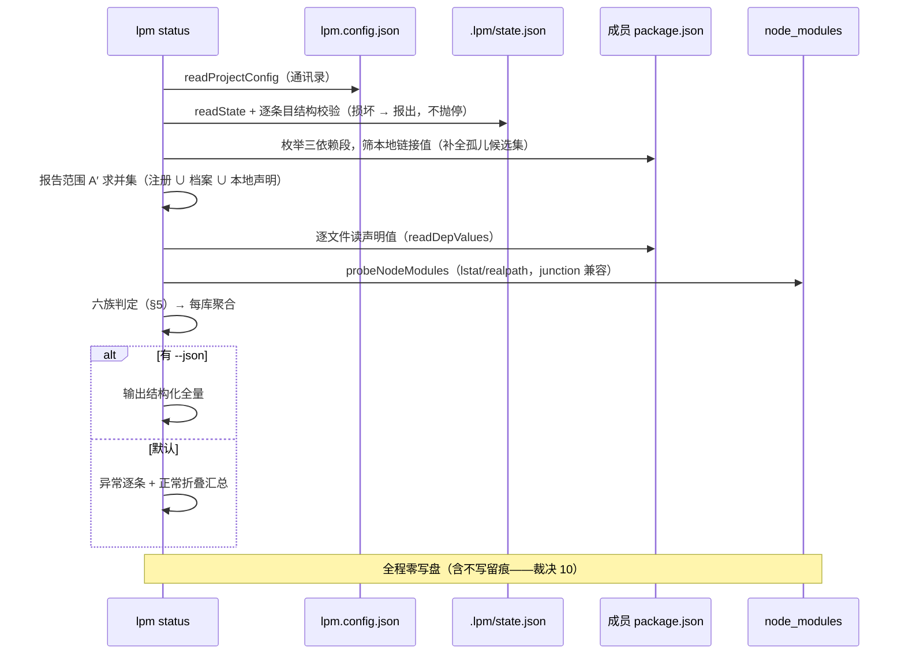
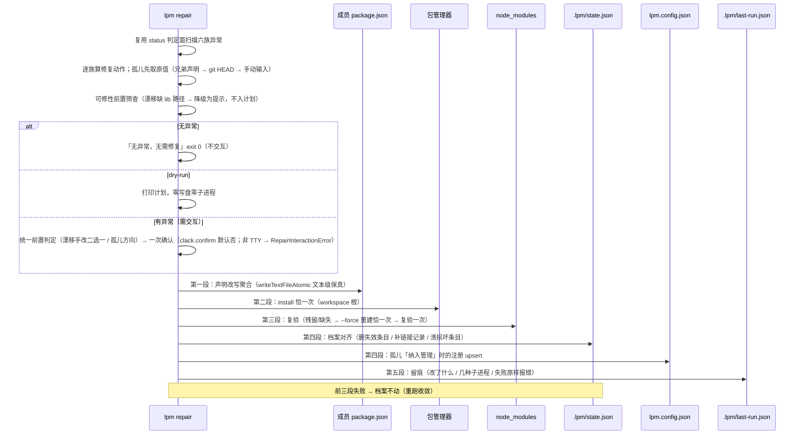

# S8 status + repair 设计 spec

> 状态：**已终审通过**（用户 2026-09-28 定稿；§12 三条与 §11 五条按架构建议裁决）→ 下一步 writing-plans（PRD §14 行 395）
> 落盘：2026-09-28。BASE：cb1e0e0（S7 已提交；工作树干净）
> 权威来源：PRD docs/prds/2026-09-25-lpm-v1-prd.md §7 行 262–263 / §10 行 314–344 / §11 行 346–364 / §12 行 374 / §13 行 376–386 / §14 行 407 / 附录 A 行 475；S7 spec（消费契约与判定原语）；S6 spec（写序与交互先例）
> 流程：S1–S7 惯例——本 spec 用户终审通过 → writing-plans → SDD 逐任务实施

## 1. 目标与非目标

### 目标

`lpm status [--json]` 与 `lpm repair [--dry-run]` 全链路直通：

1. **三方核对矩阵**（PRD §10 行 318–324，附录 A 行 475 承接 B8）：档案（`.lpm/state.json`）× 声明（`package.json` 实际值）× 目录（`node_modules` 实际指向）三方比对，覆盖矩阵五行并扩出两族失效记录（§5）
2. **报告范围收敛**（§4.4 A′）：只报「通讯录注册过的 ∪ 档案记过链接的 ∪ 声明值为本地链接的」库；屏幕默认折叠正常项为汇总，`--json` 输出全量供脚本与 E2E 消费（PRD §7 行 262）
3. **repair 具备完整写动作**：drift / 装了没生效 / 残留链接 / 孤儿 / 失效记录 / 损坏条目六族异常全部由工具自己修（§4.5）；写序自定并保证崩溃安全（档案最后动）
4. **node_modules 探查原语提取**：`src/core/nmcheck.ts` 承载「链接实际指向哪」的判定，unlink/status/repair 共用一份（link 侧不做复验——S6 非目标；Windows junction 兼容 = realpath 比对，PRD §10 行 328）
5. **运行留痕**：新增 `.lpm/last-run.json`，由 link/unlink/repair 写入——记最近一次「改了什么、跑了几次子进程、失败的原始报错」，使一次性的故障瞬间在终端关闭后仍有据可查（§4.6）
6. **收敛 S7 遗留**（S7 spec §9 自决 5）：全文件缺失的档案条目由 repair 清理（此前被保守保留）

### 非目标

- 无参数交互模式升级（S9）；status/repair 的交互化改造（S9）——本阶段 repair 仅保留最小交互：一次确认 + 孤儿来源选择
- `--last` / `--all` / `--preset` 集合操作（S10）；注册管理（S11）；全局模糊纠错与错误即建议（S12）
- **未注册库的 node_modules 全量扫描**（§5 注：有意划界，非遗漏）
- `peerDependencies` 段不纳入核对与修复（lpm 从不改 peer，报了也无动作——PRD §9 行 312）
- 真实 yarn/npm 全链自动化（PRD §12 行 374：smoke 归用户手测；沿用 S6/S7 口径）
- state 并发写保护（同 S6 §9 候选 9，触发信号出现再评估）

## 2. 关键裁决（brainstorming 2026-09-28 拍板）

| # | 裁决 | 定版 |
|---|---|---|
| 1 | repair 的写动作边界 | **具备完整写动作**（PRD §13 行 383「repair 可清」字面；§10 行 324 的「提示重跑 install」解读为该矩阵行的提示文案，非 repair 全局边界） |
| 2 | 「提示用户自行处理」的准入门槛 | **先回答根源**：信息真的只存在于用户意图中（如用户手动升级了 range，工具推不出意图）、或环境故障（git 不可用且无其他来源）才允许停下问；其余一律工具自己动手——「有建议但让人来做」等于把风险转包给使用者 |
| 3 | 交互确认 ≠ 转包 | `lpm repair` 保留一次确认（PRD §7 行 263「交互确认」）：**全部动作由工具算好**，用户只按 y/n；确认是写盘前的安全闸门，不是把判断推给用户 |
| 4 | node_modules 探查原语归属 | 提取为 `src/core/nmcheck.ts` 的 `probeNodeModules`，unlink/status/repair 共用（link 侧不做复验——S6 非目标）；**返回事实、由调用方解释**；unlink 侧文案逐字不变（S7 测试断言这些字符串） |
| 5 | 档案条目校验复用 | `validateEntry` + `LinkStateCorruptError` 扩为导出，定义仍在 `src/commands/unlink.ts`（S7 自决 9 先例：命令域错误类归命令文件）；status/repair 经 import 复用，**不迁 core**（避免动 S7 测试的 import 面） |
| 6 | 孤儿原值恢复复用 | 导出 link.ts 的 `ternaryOriginal` + `ABANDON` 哨兵（S6 已实现 git HEAD 预取 / 手动输入 / 放弃三选一）；repair 在其前加一步「同库其他声明文件里的正式版本号」候选；link 现有调用点零改动 |
| 7 | status 报告范围 | **A′**＝通讯录注册的 ∪ 档案记过链接的 ∪ 声明值为本地链接的；第三类**精确匹配**协议前缀（`link:` / `file:` / `portal:`）或裸相对/绝对路径（`./`、`../`、`/` 开头），禁用「长得不像版本号」这类模糊判定（否则 `workspace:*`、`github:user/repo`、`npm:别名@1` 会被误报为孤儿） |
| 8 | status 输出粒度 | 每库一条，内部按文件展开（state 的 original 键本就是文件级）；屏幕默认只列异常，正常项折叠为一行汇总；`--json` 全量（脚本与 E2E 需要完整数据） |
| 9 | status 退出码 | **0 = 核对完成**（含发现异常）；1 = 无法核对（workspace 找不到 / manifest 不可解析 / PM 无法解析）；脚本要判异常读 JSON 的 `summary`——若异常也返回 1，脚本无法区分「有问题」和「命令坏了」 |
| 10 | 运行留痕 | 新增 `.lpm/last-run.json`，**由 link / unlink / repair 写，status 不写**：status 是纯只读诊断，其结论随时可重放（重跑一遍即得），且不该产生「凭空创建 `.lpm/` 目录」的副作用；留痕要留的是**一次性事件**（子进程失败的原样报错、改动清单）。写留痕失败**不影响主流程**（try/catch 吞掉并仅 stderr 提示） |
| 11 | repair 写序 | **声明改写 → install → 复验/`--force` → 档案对齐（state/config）→ 留痕**：档案最后动，与 unlink 侧崩溃安全原则同构（PRD §11 行 364：档案是可抛弃的重建物，源码与 package.json 才是真相）；中途崩溃 → 档案仍在 → 重跑收敛 |
| 12 | 损坏条目处理 | repair 确认后**删条目**并提示「若声明仍是本地链接，重跑 `lpm repair` 可继续修复」（下一轮它以孤儿身份进入修复流程）——不再把手工逃生三步甩给用户；逃生三步文案保留为最后兜底（fs 损坏等真正无解场景） |
| 13 | 范围划界（已知不管） | ① peer 段不扫描；② 未被注册、声明也是正式版本号、但 node_modules 里却是链接（`pnpm link --global` 一类无痕操作）——v1 不扫全量 node_modules，成本与噪音过高；**该口子比看起来小**：只要该库在通讯录注册过，其 node_modules 照样被查（§5「残留链接」族），真正漏的只有「连注册都没有」的 |
| 14 | 覆盖用户手改值的防护 | 凡修复动作会写掉「用户手动改动过的值」，一律先停下二选一，**不得静默覆盖**（漂移族与残留链接族，§4.4/§4.5；与 S7 三态恢复 B1 防护同源） |
| 15 | 漂移修复的 lib 路径前置 | 漂移**判定**只需两列（档案 + 声明），但**修复**要拿 lib 绝对路径喂 `mapProtocol`，而该路径只存在于 `lpm.config.json`（档案的 original 里没有）→ **注册缺失时无法自动修复**：该库标为「需先重建注册」，repair 不产生该动作，提示 `lpm link <路径>`（若 node_modules 实际指向可解析，则一并给出倒推出的路径；不可解析则只给提示） |
| 16 | 孤儿「纳入管理」的前置校验 | ② 之前必须校验 lib 目录存在且含 `package.json`：不满足 → **选项②不出现**（防把坏路径写进通讯录）；选②后若目录探测不是 `link-to-lib`（链接缺失/悬空/指向他处）→ 触发 install + 复验（否则「纳入管理」会登记一条实际没生效的链接） |
| 17 | 失效记录删除的「不可逆」保险（终审 2026-09-28） | 删除本身可接受——原值通常仍在 git 历史里（该 manifest 曾入库）。配三道保险：① git 历史为兜底（文案不作承诺，仅作事实说明）；② 计划里**原样展示**被删记录的原值（§4.5 三类信息之③）；③ 删除动作连同**被删原值**记入 `last-run.json` 的 `changes[].detail`（尽力而为的追溯，非可靠备份——留痕只留最近一次） |
| 18 | 实现期接口级裁定固化（2026-09-28，随实现回写） | ① `LastRunTrace.changes[].action` = **四值**（含 `write-state`）；② `RepairInteractionError` **无 `kind`** 参数（`kind='source'` 经评审判定不可达，已删）；③ `isLocalish`（本地链接值判定）**单源在 `status.ts`**，repair 复用；④ **成员清单不可读即 exit 1**（透传 `ManifestParseError`，不改降级续跑）；⑤ **取消 → 被修对象零改动、留痕除外，exit 1**。逐条偏差与落点见 §10「实现期实测」 |

## 3. 数据流

### 3.1 status（纯只读）



### 3.2 repair（写动作，档案最后动）



## 4. 接口与行为契约

### 4.1 命令面（PRD §7 行 262–263）

```
lpm status [--json]
lpm repair [--dry-run]
```

- `status` 只读；不接受位置参数；不接 `--dry-run`（语义已天然满足——与 `lpm use` 同口径）
- `repair` 不接受位置参数；`--dry-run` 打印计划零副作用；无 TTY 且存在待修项 → `RepairInteractionError`（提示改用 `--dry-run` 查看）
- 两者 description 均不带「（计划 S8）」后缀（S3/S6/S7 接线惯例）

### 4.2 分层与文件

| 文件 | 变更 |
|---|---|
| `src/core/nmcheck.ts` | **新增**：`probeNodeModules` + `NmProbe` / `NmStatus`（从 unlink.ts 的 `verifyResidue` 提取，判定逻辑与文案零变化） |
| `src/commands/status.ts` | **新增**：三方核对 + 输出（只读，唯一 status 编排层） |
| `src/commands/repair.ts` | **新增**：六族修复编排（唯一 repair 编排层） |
| `src/commands/run-trace.ts` | **新增**：失败留痕工厂 `traceFailure(command, rootDir, pm, changes, installs, err)`——link/unlink/repair 三处 catch 的失败留痕构造单源（含 `InstallError` 收窄与字段提取）；需 `InstallError` 故放命令层（不进 `src/state/`，避免 state→core/install 分层耦合）——S8 OCR 评审 ③ |
| `src/state/index.ts` | **新增 1 导出**：`writeRunTrace` + `LastRunTrace` 类型（`.lpm/` 文件路径逻辑单源留在 state 层；既有 12 导出零改动） |
| `src/commands/unlink.ts` | `verifyResidue` 改为调用 `probeNodeModules`（解释层留在本文件）；`validateEntry` 扩为导出；末尾加一次 `writeRunTrace`；既有行为与文案零变化（顺手项 §11 #1 的计数回滚一并落位） |
| `src/commands/link.ts` | `ternaryOriginal` + `ABANDON` 扩为导出（零逻辑改动）；末尾加一次 `writeRunTrace` |
| `src/cli.ts` | status / repair 特判接线（镜像 link/unlink 分支） |
| `tests/unit/nmcheck.test.ts`、`status-command.test.ts`、`repair-command.test.ts`、`unlink-command.test.ts`、`state.test.ts`、`link-command.test.ts`；`tests/e2e/cli.e2e.test.ts` | 测试 |

### 4.3 公共 API 面

**冻结面零改动**：S1 §4.3/§4.4、S3 §4.3、S5 rewriter 7 导出、S6 §4.3、S7 §4.3 所列公共 API 的既有签名不变（`unlink.ts` 的 `verifyResidue` 是私有函数，移动不触碰冻结面）。新增导出沿用「公共 API 冻结面约定」：

```ts
// ── src/core/nmcheck.ts（全部新增）──
export type NmStatus = 'entity' | 'link-to-lib' | 'link-elsewhere' | 'dangling' | 'missing' | 'unknown'

export interface NmProbe {
  status: NmStatus
  realTarget?: string   // 链接实际指向（link-to-lib / link-elsewhere 时可解析）
  note?: string         // '悬空链接' / '注册缺失/库已删，无法比对指向'
}

/** 探查 <manifest 所在目录>/node_modules/<key> 的真实形态。
 *  - expectedLibReal：**已 realpath 解析过的期望真实路径**；解析失败（注册缺失 / 库已删 / 跨盘符）
 *    由**调用方**置 null（本函数不再解析期望值——realpath 的 try/catch 归属单一，S7 现行为）
 *  - expectedLibReal = null → 条目存在则 'unknown' + note，不存在则 'missing'
 *  - symlink 与 junction 一律经 realpath 比对（PRD 行 328）
 *  - 本函数只返回事实，异常语义由调用方解释（unlink 侧映射见 §9 自决 1） */
export function probeNodeModules(manifestPath: string, key: string, expectedLibReal: string | null): NmProbe

// ── src/commands/status.ts（全部新增）──
export interface StatusOptions { json?: boolean }
export async function runStatus(opts: StatusOptions, cwd?: string): Promise<number>   // 0 核对完成 / 1 无法核对

// ── src/commands/repair.ts（全部新增）──
export interface RepairOptions { dryRun?: boolean }
/** 存在待修项但无法交互（非 TTY）——唯一入口（原 kind='source' 分支经第 2 轮评审判定不可达，已删） */
export class RepairInteractionError extends Error {
  constructor(message: string)
}
export async function runRepair(opts: RepairOptions, cwd?: string): Promise<number>   // 0 完成（含无异常）/ 1 失败或放弃

// ── src/state/index.ts（新增 1 导出）──
export interface LastRunTrace {
  version: 1
  command: 'link' | 'unlink' | 'repair'
  at: string                    // ISO 8601
  rootDir: string
  packageManager: PackageManagerId
  result: 'ok' | 'failed'
  /** target：被改动的**对象**——manifest 相对路径（文件动作）或 lib 名 / '.lpm/state.json'（档案动作）；
   *  （lib 名 = 注册 upsert 的档案动作；'.lpm/state.json' = `writeState` 对 links 整体的档案动作，见 `src/state/types.ts`）；detail 为人读说明
   *  action 为**四值**（实现期裁定，T2）：rewrite-manifest=改写声明；write-state=写档案 state.json 的**部分**改动
   *  （link 的 writeState、unlink 的部分删除、repair 的补档案/更新 original/纳入管理都用它）；delete-entry=删档案条目/整文件；
   *  upsert-registration=注册 upsert（lpm.config.json）——档案写入无处表示会让留痕失真，故补第四值 */
  changes: Array<{ target: string; action: 'rewrite-manifest' | 'write-state' | 'delete-entry' | 'upsert-registration'; detail: string }>
  installs: Array<{ command: string; ok: boolean; exitCode: number | null }>
  failure: { command: string; exitCode: number | null; stderrTail: string; message: string } | null
}
export async function writeRunTrace(rootDir: string, trace: LastRunTrace): Promise<void>   // 原子写；调用方负责吞异常（裁决 10）

// ── src/commands/unlink.ts（扩为导出；定义与行为零变化）──
export function validateEntry(key: string, entry: LinkState['links'][string] | undefined): Record<string, string>

// ── src/commands/link.ts（扩为导出；逻辑零变化）──
export const ABANDON: unique symbol
export async function ternaryOriginal(
  rootDir: string, key: string, pkgName: string, hits: DepHit[],
): Promise<Map<string, string> | typeof ABANDON>
```

### 4.4 status 行为契约

**报告范围 A′**（裁决 7）＝三集合求并：

1. `lpm.config.json` 的 `libs` 键（注册过）
2. `.lpm/state.json` 的 `links` 键（档案记过链接）
3. 各成员 manifest 三依赖段中**值**为本地链接的库名（精确匹配 `LOCAL_PROTOCOL_RE`，或匹配裸路径 `^(\.{1,2}[/\\]|/|[A-Za-z]:[/\\])`）

集合 3 的枚举方式：JSON 解析每个成员 manifest（剥 BOM；值非字符串的条目跳过）。成员 `package.json` 解析失败 → **无法核对，exit 1**（透传 `ManifestParseError`，见 §6 错误表 #5）——原「解析失败 → 该 manifest 报为不可读，status 继续跑其余」的降级句与 §6 冲突，**以 §6 为准**，实现期作废（随之「不可读 manifest」的字段/输出/提示一并删除）。**只用于检测读值**——link/unlink 的**改写**仍走 S5 文本级引擎，二者不冲突。

**(库, 文件) 的代表值口径**：取三改写段中的**规范段序首个命中段**的值（`readDepValues` 输出序——与 S7 §9 自决 3 同口径，防两侧判定漂移）；`files[].sections` 列出全部命中段；多段值不一致时屏幕输出附警告（沿用 S7 OCR O8 的文案口径），判定仍以代表值为准。

**逐 (库, 文件) 判定**（PRD §10 矩阵五行 + 扩两族）：

| 档案 | 声明值 | node_modules | 判定 | repair 动作 |
|---|---|---|---|---|
| 记着 | 本地链接 | 指向该库 | ✅ 已链接 | — |
| 记着 | 本地链接 | 实体／指向他处／悬空／缺失 | ⚠️ 装了没生效 | install → 复验 → 必要时 `--force` |
| 记着 | 正式版本号 | 任意 | ⚠️ 漂移（值 == 档案 original → 被还原；值 ≠ original → 用户手改过，修复须二选一；注册缺失 → 无法自动修复，裁决 15） | 恢复本地链接（`mapProtocol` 重写）→ install → 复验 |
| 没记 | 本地链接 | 任意 | ⚠️ 孤儿 | 取原值 → ① 恢复正式版本，或 ② 纳入 lpm 管理 |
| 记着 | 文件里已无该依赖 / 文件不存在 | 任意 | ⚠️ 失效记录 | 确认后清掉档案里该部分 |
| 记着但结构坏 | — | — | ⚠️ 记录损坏 | 确认后删条目 + 提示重跑 |
| 没记 | 正式版本号 | 链接（指向某处） | ⚠️ 残留链接 | install → 复验 → 必要时 `--force` |

**库级聚合**：`status: 'ok' | 'issue'` + `issues: string[]`（不设人为严重度排序——一个库可同时命中多族，如实列出）。

**汇总口径**：`summary.issue` = 存在至少一族异常的**库数**；`summary.issueCounts` 按 **(库 × 族)** 计数（一个库命中两族则两族各计 1），故其和可大于 `issue`；`summary.ok` = 其余库数（`ok + issue = total`）。

**屏幕输出（默认）**：

```
核对完成：3 个库（1 正常 / 2 异常）

⚠️ @seedhuang/ai_suit_tool —— 漂移（声明已被改回正式版本号）
   档案记录：^1.2.0（2026-09-27 链接）
   apps/web/package.json：^1.2.0（期望 link:../../ai_suit_tool）
   node_modules：链接仍指向 d:/Seed/ai_suit_tool
   → 修复：lpm repair

⚠️ @seedhuang/old_lib —— 记录损坏
   → 修复：lpm repair（将清除损坏记录）
```

正常项折叠为一行（如「其余 1 个已注册库当前使用正式版本，正常」）。

**`--json` 结构**（顶层 `version` / `rootDir` / `packageManager` / `summary` / `entries`）：

```json
{
  "version": 1,
  "rootDir": "d:/Seed/BFM",
  "packageManager": "pnpm",
  "summary": { "total": 3, "ok": 1, "issue": 2, "issueCounts": { "drifted": 1, "corrupt": 1 } },
  "entries": [
    {
      "key": "@seedhuang/ai_suit_tool",
      "registered": true,
      "recorded": true,
      "linkedAt": "2026-09-27T14:03:11.220Z",
      "original": { "apps/web/package.json": "^1.2.0" },
      "files": [
        {
          "manifest": "apps/web/package.json",
          "declared": "^1.2.0",
          "sections": ["dependencies"],
          "nm": { "status": "link-to-lib", "realTarget": "d:/Seed/ai_suit_tool" }
        }
      ],
      "status": "issue",
      "issues": ["drifted"],
      "suggestion": "lpm repair"
    }
  ]
}
```

**退出码**（裁决 9）：0 = 核对完成；1 = 无法核对。

### 4.5 repair 行为契约

**扫描**：与 status 共用同一套判定面（同范围 A′、同六族）；实现上由 repair 复用 status 的内部扫描函数而非二次拼装。

**逐族动作**（写序遵循裁决 11）：

| 族 | 动作 |
|---|---|
| 装了没生效 | 聚合后 install 恰一次 → 复验 → 有残留/缺失则 `--force` 重建恰一次 → 再复验一次 |
| 漂移 | **先做可修性筛查**（裁决 15）：lib 绝对路径不可得（注册缺失且目录指向无法解析）→ 不入计划，降级为提示「先 `lpm link <路径>` 重建注册」。路径可得时按「声明值 vs 档案 original」分两支（裁决 14 防静默覆盖）：**相等** → 直接用 `mapProtocol(pm, libDirAbs, dirname(manifest))` 重写为本地链接；**不等（用户手改过）** → 统一前置判定阶段停下二选一：① 以当前值作为新 original 并恢复链接（保留你的改动）／② 丢弃当前值、恢复链接并保留原 original。两支并入同一次 install/复验 |
| 残留链接 | 同上（install 使 PM 重建为实体）；计划须列出目录**当前指向**（用户手动 `pnpm link` 与真残留不可区分，靠确认闸门兜底） |
| 孤儿 | **先取原值**，再令用户二选一：①「恢复正式版本」＝写回原值 → 并入 install；②「纳入 lpm 管理」＝**校验 lib 目录存在且含 `package.json`**（裁决 16，不满足则②不出现在菜单）→ 注册 upsert + 补档案（original = 原值，声明不动）+ **若目录探测非 `link-to-lib` 则并入 install/复验**。取不到原值 → 不提供选项②（否则将来 unlink 会「恢复」成链接值，永久丢失——S6 E4 安全规则） |
| 失效记录 | 确认后清掉档案中该部分（文件级出局；整条全失效 → 删整条）；**被删记录的原值须原样进计划展示、并记入留痕 `detail`**（裁决 17 三道保险） |
| 记录损坏 | 确认后删条目 + 提示重跑 |

**复验最终仍不通过时的处置**（S8 最终评审 ⑥ 裁定，2026-09-28）：装了没生效 / 残留链接 / 漂移等族走「install → 复验 → `--force` 重建 → 再复验」；若**最终仍不通过**（残留/缺失未消除），只打印警告、**退出码仍为 0**（沿用 unlink 既有惯例）。这意味着**按退出码判「是否真的修好」不可靠**——自动化调用方若要确认最终结果，应读取 stderr 的「复验未通过」警告，或重跑 `lpm status` 复核（两者都可行；退出码只表达「流程是否跑完」，不表达「目录是否已就位」）。

**孤儿取值的机器优先顺序**（裁决 6）：

1. **同库其他声明文件里的正式版本号**（`findDependents` 的命中中，值非本地链接者）——monorepo 高发场景，最快
2. **git HEAD 预取**（复用 `ternaryOriginal`：`git show HEAD:<relpath>`，全部命中文件均取到非本地值才可用）
3. **手动输入**（复用 `ternaryOriginal`：3 次重试、空串/本地协议拒绝）
4. **放弃该库**（不改盘，提示重跑或手工处理）

第一级为机器来源，**唯一取值时自动采用、不再让用户重填**；**多个兄弟值不一致时降级不采用**（不同成员可合法 pin 不同 range，取错值比不取更糟）→ 落到第二级。一二级全空才弹输入菜单（复用 `ternaryOriginal` 的手动通道）。

**方向的二选一仍需问用户**：选「恢复正式版本」还是「纳入 lpm 管理」只存在于用户意图中，工具推不出——这是裁决 2 的合法例外（信息不在机器侧）。按 PRD §8.4「统一前置判定」，方向选择与漂移族的手改二选一都在扫描阶段逐库问完，随后与全部动作合成一份计划、一次确认；**取不到原值时选项②不出现在菜单里**（否则将来 unlink 会「恢复」成链接值，永久丢失）。

机器命中来源时，取到的值在计划里显式展示（「apps/web 将恢复为 ^1.2.0（来源：apps/server 的声明）」），随确认一并放行。

**确认**：把全部动作编成计划 → `clack.confirm`（**默认值 false**——本次计划含不可逆的档案删除，必须显式确认，防误按回车执行；PRD §16 关闭项「单次回车是防误触最后闸门」同精神）→ 一次放行（PRD §8.4：统一前置判定，禁止执行中途打断）。取消 → **被修对象（manifest / state / config）零改动、留痕除外；exit 1**（§4.6「成功与失败都写」优先——一次纯取消仍会落一条失败留痕）。计划**必须显式展示三类信息**（否则确认形同虚设）：

1. 每个文件的改写明细（`原值 → 新值`）
2. 将被覆盖的当前值（残留链接族列出目录当前指向；漂移族列出被替换的手改值）
3. **不可逆的档案动作**（条目/文件级记录的删除，注明其 `original` 值将丢失）

**`--dry-run`**：打印同一份计划，零写盘零子进程（镜像 S6 K / S7 H 契约）。

**无异常**：打印「无异常，无需修复」exit 0，不进入交互（自动化可安全调用）。

**实现期裁定补记（接口级，回写自 T3/T4）**：

- `isLocalish`（本地链接值判定 = `LOCAL_PROTOCOL_RE` 或裸路径）**单源落在 `src/commands/status.ts`**（与判定面 `scanLinkState` 同处，即 §9 自决 2 的「判定面单源」）；`repair.ts` 经 import 复用，不再各留一份（与 `validateEntry` 跨命令 import 同型先例）。
- `corrupt` 条目被删时，计划里展示的**被删原值由 repair 从 `state.links[key]` 现读并序列化**（不为此改 `status.ts`）——`validateEntry` 抛错后 `entry.original` 为 `undefined`，若直接序列化会得到空的 `{}`，使裁决 17 第二道保险（原值原样展示）失效。

### 4.6 运行留痕（`.lpm/last-run.json`）

- **写入方**：link / unlink / repair（裁决 10）；status 不写
- **时机**：命令收尾（成功与失败都写）；失败路径在 `reportError` 之前捕获证据
- **内容**：见 §4.3 的 `LastRunTrace`——改动的对象与动作、子进程命令与退出码、失败时的原样 stderr 末尾
- **语义**：**只保留最近一次**（新的一次覆盖旧的），文件不会无限增长；已知代价见 §10 候选第 19 条
- **失败处理**：写留痕自身异常一律吞掉 + stderr 一行提示，**绝不影响主流程**
- **可删可重建**：与 state/last/config 同级（PRD §11 行 364 逃生门原则）

## 5. 状态判定矩阵（六族异常的两端呈现）

| 族 | status 呈现 | repair 动作 | PRD 依据 |
|---|---|---|---|
| `drifted` 漂移 | 档案记着链接 + 声明是正式版本号 | 恢复本地链接 + install（声明值 ≠ original 时先二选一；lib 路径不可得 → 降级提示——裁决 14 / 15） | §10 行 322 |
| `install-ineffective` 装了没生效 | 档案记着 + 声明是本地链接 + 目录不对 | install + 复验 + `--force` | §10 行 324 + §11 行 361 |
| `orphan` 孤儿 | 无档案 + 声明是本地链接 | 取原值 → 恢复正式版 / 纳入管理（②须 lib 目录有效，且链接未生效时并入 install——裁决 16） | §10 行 323 |
| `stale-link` 残留链接 | 无档案 + 声明是正式版本号 + 目录是链接 | install + 复验 + `--force`（计划列出当前指向） | §10 行 326（Already up to date 陷阱） |
| `stale-record` 失效记录 | 档案指向的文件不存在 / 已不再声明该依赖 | 确认后清档案 | S7 §9 自决 5 收敛点 |
| `corrupt` 记录损坏 | 条目结构不合法（复用 S7 校验） | 确认后删条目 → 提示重跑 | §11 行 362（逃生门原则改造） |

> **注（有意划界，裁决 13）**：未被注册、声明也是正式版本号、目录里却是链接的库，v1 不发现——需扫描全部成员 node_modules，成本与噪音过高。注册过的库不受此限（`stale-link` 族覆盖）。

## 6. 错误表（新增项；既有错误类透传）

| # | 错误 | 触发 | 输出 | 退出码 |
|---|---|---|---|---|
| 1 | `RepairInteractionError` | 存在待修项但非 TTY | 「需交互确认修复计划。请改用 `lpm repair --dry-run` 查看计划」 | 1 |
| 2 | 计划被取消（`clack.isCancel`） | 用户取消确认 | 「已取消」 | 1 |
| 3 | `InstallError` | install / `--force` 失败 | 既有文案 + repair 向建议（「档案未改动，重跑 `lpm repair` 收敛」） | 1 |
| 4 | `ProtocolPathError` | 漂移修复时 `mapProtocol` 遇跨盘符（`path.relative` 退化为绝对路径） | 既有文案 | 1 |
| 5 | `WorkspaceNotFoundError` / `ManifestParseError` / `WorkspacePatternError` / `PMAmbiguousError` / `PMUnresolvedError` / `LpmConfigParseError` / `LpmStateParseError` | 既有 | 透传既有文案 | 1 |

> `status` 与 `repair` 均**不抛** `LinkStateCorruptError`（该错误仍由 `lpm unlink` 抛出，S7 行为不变）：status 归 `corrupt` 族如实报告（只读诊断的职责是报告，不是中断）；repair 归 `corrupt` 族、确认后删条目（§4.5）。
> `ProtocolPathError` 在 link 的 KNOWN 列表中既有（link.ts reportError），repair 须并入同一处理口径。
> `LpmStateParseError` 属于「无法核对」：status 直接 exit 1（文案已指向逃生门：删除该文件重建）；是否降级为「报出 + 其余两列照常」列为 §10 候选第 19 条。

## 7. 测试清单（计数为 `pnpm verify` 实测定版：unit **20 文件 / 324 用例**；e2e **1 文件 / 26 用例**）

- **nmcheck**：六种 `NmStatus` 全覆盖（entity / link-to-lib / link-elsewhere / dangling / missing / unknown）+ symlink 与 junction fixture + `expectedLibReal=null` 两分支 + **祖先目录为 junction 时真实实体不误判为链接（NMC-7，S8 OCR 评审 ①）**
- **unlink-command 零回归**：既有 30 it 全绿（文案逐字不变），另加 `probeNodeModules` 迁移后的等价性断言（残留/悬空/缺失/注册缺失四种 note）
- **status-command**：范围 A′ 三集合各自的命中与并集去重；六族判定全矩阵（含 Windows junction fixture）；代表值口径（多段命中取规范段序首段 + 异值警告）；`--json` schema 字段与汇总口径（`ok + issue = total`、`issueCounts` 按库×族）；正常项折叠 + 异常逐条；退出码 0/1 两分支；**坏成员清单 → exit 1（透传 `ManifestParseError`）**；`cfg.libs` 原型链成员（`constructor` 等）不被当注册项；**`links[key]` 为 `null` → 归 corrupt 族如实报告不崩（ST-11）**；**`--json` 的 `realTarget` 归一为正斜杠（ST-8）**
- **repair-command**：六族动作全矩阵（install 次数断言：多族并发恰一次 install、恰一次复验、至多一次 `--force`）；**漂移三支**（值 == original 直修 / 值 ≠ original → 二选一 / **lib 路径不可得 → 降级提示且不入计划**）；**孤儿② 前置校验**（lib 目录缺失 → ② 不出现；目录有效但链接未生效 → 触发 install）；**孤儿多兄弟值不一致 → 降级到下一级来源**；孤儿取值三级顺序（兄弟声明 → git HEAD → 手动输入 → 放弃）；非 TTY 报错；`--dry-run` 计划逐行 + 零副作用；**取消 → 被修对象零改动（留痕除外）**；**确认默认值为否**；无异常早退不交互；写序断言（install 失败 → 档案零改动 → 重跑收敛）；**本阶段新增领域（T4 fix round 1）**：多成员同时 adopt → 档案 `original` 按键合并保留两个文件键与原值（REP-14）；`stale-record` 整条删除 / 文件级出局（REP-15/16）；`corrupt` 删条目 + 留痕 detail 含被删原值（REP-17）；兄弟值不一致降级到下一级来源（REP-18）；`ProtocolPathError` 跨盘符透传 exit 1（REP-19）；注册在但库目录已删（`libReal=null`）→ 降级提示指向 `lpm link`（REP-20）
- **state**：`writeRunTrace` 原子写 + 内容 schema + 目录缺失时自动建 + 覆盖语义（新一次覆盖旧一次）；`.gitignore` 防护（STR-T1/T2/T3）
- **link / unlink 留痕与顺手项**：末尾留痕写入**成功与失败两态**；**失败 dry-run 零写盘**；**O4 计数回滚**（isCancel 放弃时 `planIdempotent` / `planMissing` 回滚）；`ternaryOriginal` 导出后既有用例零回归
- **e2e**：`lpm status`（唯一 fixture、正常态，`--json` 断言）+ `lpm repair --dry-run`（计划明细 + 项目 byte 级零变化）+ `lpm repair` 无异常早退 exit 0 + `--help` status/repair 行无计划后缀 + `E2E-ACC6`（验收 6，见下行）。**无异常 status fixture、repair 非 TTY 均不在 e2e**：前者受 T3 deferred 限制（e2e 仅正常 fixture），后者由 unit `REP-9` 覆盖
- **验收 6 自动化**（PRD §13 行 383/386，E2E-ACC6）：fixture 构造漂移（手动 `git checkout package.json` 的等价形态）→ `lpm status --json` 断言 `issues` 含 `drifted` → `lpm repair --dry-run` 断言计划出现目标链接值（`link:../../lpm-lib`）**且项目文件 byte 级不变**（真实修复动作由 unit REP-3 以 install mock 覆盖）

## 8. 后续衔接

| 消费方 | 依赖的 S8 产出 |
|---|---|
| S9 交互层 | status 判定面复用为交互列表的状态标记（unlink 列表的 `[漂移]` 标记数据源）；repair 计划结构复用为执行计划预览 |
| S10 集合预设 | repair 的孤儿「纳入管理」路径与 `--last` 恢复共用注册 upsert 先例 |
| S11 注册管理 | `stale-record` / 库目录已删 / 漂移「需重建注册」的提示可导向 forget 与 link；注册 upsert 逻辑单源 |
| S12 引导性打磨 | `last-run.json` 可作为「错误即建议」的证据源；status 的 `suggestion` 字段全局化 |
| S13 utoopack 适配 | `repoRoot` / node_modules 探查原语可复用 |

## 9. 实现期自决细节（非决策，评审可否决）

1. `probeNodeModules` → unlink 侧解释映射（文案逐字保留）：`link-to-lib` → residue「软链残留」；`dangling` → residue「悬空链接」；`missing` → missing；`entity` → ok；`link-elsewhere` → ok（无 note，S7 现行为）；`unknown` → ok + note「注册缺失/库已删，无法比对指向」
2. `status` 与 `repair` 共用扫描：抽出内部函数（如 `scanLinkState(rootDir, ws: Workspace, cfg, st)` 返回判定结果），status 只格式化、repair 只行动——避免两份范围逻辑漂移
3. 库级 `issues` 顺序按固定族序输出（drifted / install-ineffective / orphan / stale-link / stale-record / corrupt），保证 `--json` 与屏幕输出稳定可断言
4. repair 的 install/复验触发面：**存在声明改写（漂移 / 孤儿①）**、或 **`install-ineffective` / `stale-link` 族**、或 **孤儿② 且目录探测非 `link-to-lib`** 时才跑 install（纯 `stale-record` / `corrupt` / 漂移降级 不触发子进程）
5. 孤儿「纳入管理」时档案补记的 original 键格式沿用 `'<相对根>/package.json'`（根命中 `'package.json'`）；注册路径用 `toRel(rootDir, libDirAbs)`
6. `last-run.json` 的 `changes` 只记写盘动作（manifest 改写、档案条目增删、注册 upsert），不记纯检测结论
7. status 的 `--json` 不输出 ANSI 着色
8. `status` 与 `repair` 均拒绝位置参数（commander 层 `allowExcessArguments(false)` 或声明空 argument）
9. `cfg.libs[key]` 与 `st.links[key]` 的所有读取一律 `Object.hasOwn` 守卫（与 S7 OCR O2 同族防护——防 `constructor` / `toString` 等原型链成员被当作有效项）
10. `cfg.libs[key]` 值非字符串（配置损坏）→ 该库标为「无法比对」并附注，**不抛错中断**（status 的职责是报告）；repair 对该库不产生动作（该路径也自然覆盖裁决 15 的「lib 路径不可得」）

## 10. 评审 Backlog

### 自审第 1 轮（2026-09-28，multi-lens-review：六手法 + 场景 B 角色面板）

1 矛盾 + 2 盲点 + 7 优化；最危险项 = 「漂移修复会静默丢弃用户手改的 range」。

| # | 级别 | 问题 | 来源透镜 | 归因 | 处置 | 落点 |
|---|---|---|---|---|---|---|
| 1 | 矛盾 | 漂移族未区分「声明值 == 档案 original」与「用户手改过」：后者直接恢复链接会把用户手改的值静默顶掉，将来 unlink 再「恢复」成旧值——B1 类不可逆数据丢失（S7 已为该场景设防，repair 反而没有） | 手法 1 × 手法 6 | 假设未显式化 | **已采纳（修复）** | §2 裁决 14 / §4.4 / §4.5 / §5 |
| 2 | 盲点 | 孤儿首选来源「同库其他声明文件里的正式版本号」在多个兄弟值不一致时会取错值 | 手法 5 | 假设未显式化 | **已采纳（修复）**：不一致即降级 | §4.5 孤儿取值段 |
| 3 | 盲点 | 确认计划未要求列出**不可逆的档案删除** | 手法 6 | 流程缺失 | **已采纳（修复）**：计划必列三类信息 | §4.5 确认段 |
| 4 | 优化 | §1 目标 4 写「link/unlink/status/repair 共用」与裁决 4 自相矛盾 | 手法 3 | 修复引入 | **已采纳（修复）** | §1 目标 4 |
| 5 | 优化 | 位置参数拒绝只提 repair，status 同样需要 | 手法 4 | 流程缺失 | **已采纳（修复）** | §9 自决 8 |
| 6 | 优化 | `cfg.libs` / `st.links` 读取缺原型链守卫；注册值非字符串时行为未定义 | 手法 2 | 知识缺失（S7 已踩过该坑） | **已采纳（修复）** | §9 自决 9 / 10 |
| 7 | 优化 | `ProtocolPathError` 未列入 repair 错误表 | 手法 4 × 手法 3 | 知识缺失 | **已采纳（修复）** | §6 #4 |
| 8 | 优化 | `state.original` 读取未做**语义**校验（值本身是本地协议值） | 手法 2 | 知识缺失（S6 写入侧已拒绝） | **候选**：真实出现污染条目 ≥ 2 次（届时与 unlink 一并评估） | — |
| 9 | 优化 | `last-run.json` 只留最近一次：失败证据可能被随后的成功运行覆盖 | 手法 2 | 假设未显式化 | **候选**：真实出现「因后续运行覆盖丢失失败证据」≥ 2 次 | §4.6 |
| 10 | 优化 | 一次确认覆盖全部动作，无法逐项取舍 | 交互设计师必问 1 | — | **关闭**：PRD §8.4 明确「统一前置判定」；不认可的那族可手工处理后重跑收敛 | — |

### 自审第 2 轮（2026-09-28，用户指令重跑；独立一遍全六手法 + 角色面板）

**2 盲点 + 8 优化**；最危险项 = 「漂移修复要用的 lib 路径根本不在档案里，注册缺失时无路可走」。

| # | 级别 | 问题 | 来源透镜 | 归因 | 处置 | 落点 |
|---|---|---|---|---|---|---|
| 11 | 盲点 | 漂移**判定**只需两列，但**修复**要 `mapProtocol` 的 lib 绝对路径——该路径只在 `lpm.config.json`，档案的 original 里没有。用户手删过注册时，漂移成为「检出得到、修不了」的死结，spec 未定义 | 手法 1（接管时刻）× 手法 5 | 假设未显式化 | **已采纳（修复）**：加可修性前置筛查 + 降级提示 | §2 裁决 15 / §4.4 / §4.5 / §5 |
| 12 | 盲点 | 孤儿②「纳入管理」会把 lib 目录不存在的坏路径写进通讯录；且②之后目录探测若非 `link-to-lib`（链接缺失/悬空）时的 install 触发未定义——等于登记一条实际没生效的链接 | 手法 1 × 手法 4 | 假设未显式化 | **已采纳（修复）**：②前校验目录 + ②后按探测结果并入 install | §2 裁决 16 / §4.5 / §9 自决 4 |
| 13 | 优化 | §4.2 的 unlink.ts 行漏了 `writeRunTrace`，与裁决 10 / §11 #4 不一致 | 手法 3（表格 × 表格） | 修复引入 | **已采纳（修复）** | §4.2 |
| 14 | 优化 | `RepairInteractionError('source')` 不可达（非 TTY 已被 confirm 分支挡住；TTY 下手动通道失败即走「放弃」）——错误表里的死条目 | 手法 3（引用 × 定义）× 手法 4 | 流程缺失 | **已采纳（修复）**：删 `source` 分支与 `kind` 参数 | §4.3 / §6 #1 |
| 15 | 优化 | `probeNodeModules` 的「期望路径」参数未定义 realpath 语义（调用方解析失败时传 null，还是函数内解析）——直接决定实现与测试写法 | 手法 5 | 假设未显式化 | **已采纳（修复）**：参数定名 `expectedLibReal`，realpath 与失败兜底归调用方（S7 现行为） | §4.3 |
| 16 | 优化 | status 的 (库, 文件) 代表值口径未写：多段命中时按哪段判定，会与 unlink 侧判定漂移 | 手法 3（表格 × 表格） | 知识缺失（S7 自决 3 已有口径） | **已采纳（修复）** | §4.4 代表值段 |
| 17 | 优化 | `summary.issueCounts` 计数口径缺失（库数 vs 库×族），E2E 断言会歧义 | 手法 3（验收 × 现状） | 知识缺失 | **已采纳（修复）** | §4.4 汇总口径 |
| 18 | 优化 | `clack.confirm` 默认值未定；默认「是」时一次误按回车即执行**不可逆**的档案删除 | 手法 6 | 知识缺失 | **已采纳（修复）**：默认 false | §4.5 确认段 |
| 19 | 优化 | state **文件级**损坏时 status 直接 exit 1，与「条目级损坏如实报告」口径不一（此时另两列信息仍有价值） | 手法 3 | 流程缺失 | **候选**：真实出现「state 文件损坏时用户需要 status 的另两列信息」≥ 2 次 | §6 注 |
| 20 | 优化 | `LastRunTrace.changes[].manifest` 在「删档案条目」动作下语义错位（删的不是文件） | 手法 2 | 知识缺失 | **已采纳（修复）**：字段改 `target` + `action` 枚举 | §4.3 |

**同族扫描（第 2 轮）**——抽象模式：「修复动作依赖某输入，而该输入的来源在 spec 里没有定义」：枚举六族的全部输入依赖 → 漂移（lib 路径，**已修** 裁决 15）／孤儿①（原值，三级来源已定义）／孤儿②（lib 目录有效性，**已修** 裁决 16）／install-ineffective（只需 install，无额外输入）／stale-link（同上）／stale-record（只需档案内容）／复验（期望真实路径，注册缺失 → `unknown` 不触发 `--force`，S7 惯例）。全部入口已定义。

**自洽确认区**（第 2 轮攻过但未攻破）：repair 后重跑 repair 收敛（六族→无异常早退）；孤儿①与漂移对同一文件的多族并发（按库互斥，不会同库双族冲突）；install 一次满足漂移与孤儿①的相反需求（PM 按 manifest 统一处理）；UNC / 绝对路径注册值（realpath 失败 → `unknown` 优雅降级，与自决 10 同族）；state 内容为 `{}` / 空文件（前者正常，后者 LpmStateParseError 指向逃生门，见候选 19）。

**终审追加候选**：**status `--strict`**（发现问题时退出码改 1，供 CI 当门禁）——触发信号：CI 需要以 status 作门禁且真实发生 ≥ 2 次（现在不加，保留干净的向后兼容扩展位）。

### 收敛判定

第 1 轮 10 条（9 采纳 / 1 关闭）→ 修复 → 手法 3 重跑零新增冲突 → 同族扫描通过；第 2 轮 10 条（2 盲点 + 8 优化，全部采纳）→ 修复 → 手法 3 重跑零新增冲突 → 同族扫描通过；**第 3 轮（本次）：零新增 P0/P1**。按 S7 同款流程（首轮 + 重跑 + 同族扫描通过）判定**收敛停止**——透镜固定后继续加轮边际收益骤降。严格口径的「连续 2 轮零新增」未满足（第 2 轮仍有新增盲点），此处如实记录，不粉饰。

### 实现期实测（2026-09-28，随 S8 实现回写）

本阶段实现期对本 spec 的**偏差与接口级裁定**（除下列条目外，实现与 spec 一致）；已按「spec 为行为权威」逐条回写正文：

| # | spec 原表述 | 实现期裁定（已回写落点） |
|---|---|---|
| 1 | §4.3 `changes[].action` 三值 | **四值**，补 `'write-state'`（档案写入无处表示会让留痕失真）——§4.3 / §2 裁决 18 |
| 2 | §4.3 `RepairInteractionError(public kind, message)` | **`constructor(message: string)`**，`kind='source'` 不可达已删（本 spec 正文已是目标态，无需再改）——§4.3 / §6（错误表已无 `source` 行） |
| 3 | §4.4 集合 3「解析失败 → 报为不可读、继续跑其余」 | **成员清单不可读即 exit 1**（透传 `ManifestParseError`；与 §6 一致，原降级句作废）；`unreadableManifests` 字段/输出/提示一并删除——§4.4 |
| 4 | §4.5「取消 → 零写盘 exit 1」 | **取消 → 被修对象（manifest/state/config）零改动、留痕除外；exit 1**（§4.6「成功与失败都写」优先）——§4.5 |
| 5 | `isLocalish` 归属未定 | **单源在 `src/commands/status.ts`**（与判定面同处），repair 经 import 复用——§4.5 补记 / §2 裁决 18 |
| 6 | `corrupt` 被删原值的展示来源未定 | 由 repair **从 `state.links[key]` 现读并序列化**（`validateEntry` 抛错后 `entry.original` 为 `undefined`，直接序列化会得空 `{}`，使裁决 17 第二道保险失效）——§4.5 补记 |

**计数定版**（取数命令 `pnpm verify`，2026-09-28，exit 0）：unit **20 文件 / 317 用例**；e2e **1 文件 / 26 用例**（含本阶段新增 E2E-ACC6）。基线为 unit 268 / e2e 21。

> **最终修复波计数更新**（2026-09-28）：最终全量评审 1 Critical + 3 Important + 3 Minor 的修复波补 6 条用例（`REP-21/22`、`ST-13/14/15/16`）→ unit **20 文件 / 323 用例**（该时点值；随后 OCR 评审轮补 NMC-7 → 终态 324，见下节）；e2e 不变 **1 文件 / 26 用例**。

**deferred minors 清单**（实现期记录、经判评判定可延后，不阻塞收口；来源 `.superpowers/sdd/2026-09-28-s8-status-repair.md/progress.md`）：

- T1：`nmcheck.ts` 实体目录真实路径 === 库注册路径时，旧实现判「软链残留」、新实现判 `entity`→ok（唯一不等价点，需手改配置把库指进 node_modules 才触发）；`normPath` 归一使比较从「逐字」变「语义」（方向更正确，知情保留）；UNL-31 只断言 force 次数、未断言屏幕文案（文案由 NMC-4 单断）。
- T1 前向注意：`isLink` 用「realpath ≠ 字面路径」判链接，若条目祖先目录本身是符号链接（POSIX `/var → /private/var`）会把实体误判为链接 → 落 `link-elsewhere`；Windows 本机未暴露。
- T2：`planMissing` 回滚实现正确但无专门用例（仅 `planIdempotent` 有断言）；`LastRunTrace` 未从 `state/index.ts` 再导出（消费方须从 `state/types.js` import）；PM 解析前失败（如 `PMAmbiguousError`）不留痕（彼时无 rootDir/pm 可写）；`last.json` 写入未纳入 `changes`（枚举无对应值）。
- T3：`--json` 为计划示例的超集（条目多 `libDirAbs`/`libReal`/`notes`，信息增补非缺陷）；屏幕文案未与 §4.4 示例逐字一致（漂移/损坏头缺括注；屏幕侧 `node_modules：链接仍指向 <反斜杠路径>`，`--json` 侧已归一）；测试覆盖缺口（无「已链接 = ok」行 1 用例、`install-ineffective` 只覆盖 entity 形态、无「仅集合 2」去重用例、无原型链成员用例）；ST-3…ST-7 只断言屏幕文案未断言 `issues` 数组。
- T4：REP-19 的 `ProtocolPathError` 文案由测试自行注入（覆盖「透传 → exit 1 → 不执行」链路，未验真实跨盘文案）；REP-18 用「二级来源菜单被弹出」间接断言多兄弟不一致降级（mock 环境无真实 git）；「计划三类信息」「stale-link 当前指向」「install 失败 `stderrTail` 内容」「确认语文案」四者均无断言。

### 实现后 OCR 评审轮（2026-09-28，workspace 模式，session c36438c2，输出 ocr-out-s8-review.txt，10m14s）

S8 全量评审通过后，用户触发 OCR（alibaba/open-code-review）评审轮。**9 条意见（0 critical / 0 high / 5 medium / 4 low）**，落在 8 个选中项上。用户裁定**采纳 7 条、候选 2 条**；完整报告见 `.superpowers/sdd/2026-09-28-s8-status-repair.md/ocr-fix-report.md`。

| # | 位置 | 级别 | 意见 | 处置 | 落点 |
|---|---|---|---|---|---|
| 1 | `src/core/nmcheck.ts:23-25` | bug · medium | `isLink` 拿 realpath 与**字面路径**比较：路径含软链祖先（macOS `/var→/private/var`、被软链的项目/家目录）或 Windows 8.3 短名时，真实目录 realpath ≠ 字面路径 → 实体被误判 `link-elsewhere` | **采纳** | 改为与「父目录 realpath + 自身文件名」比较（`basename` 具名导入）；补 NMC-7（祖先 junction → entity） |
| 2 | `src/commands/status.ts:136-138` | performance · medium | 每个 key 冗余调 `findDependents`（重读重解析全部成员清单，O(key×成员)），且形成第二份声明真相源；上方 `declaredByManifest` 已含同数据 | **采纳** | 命中文件改由 `declaredByManifest` 缓存派生；删 `findDependents`/`DepHit` 导入 |
| 3 | `src/commands/link.ts:525-526` | maintainability · medium | link/unlink/repair 三处失败留痕构造逐字重复约 18 行（`InstallError` 收窄 + 字段提取 + installs 追加 + failure 构造） | **采纳** | 新增 `src/commands/run-trace.ts` 的 `traceFailure(...)`；三处 catch 收敛为一行调用（闸门保留） |
| 4 | `src/commands/repair.ts:371-375` | style · medium | 嵌套三元（ternary in ternary） | **采纳** | 展平为显式 if/else（`verifyAll`） |
| 5 | `src/commands/status.ts:266-268` | style · medium | 嵌套三元 | **采纳** | 抽 `suggestionOf(e)` 小函数（单层 if/else） |
| 6 | `src/commands/repair.ts:367` | maintainability · low | `verifyAll(rootDir, ...)` 的 `rootDir` 从未使用（死参数） | **采纳** | 删该形参及两处调用实参 |
| 7 | `src/commands/repair.ts:362` | maintainability · low | `printPlan` 的 `if (plan.actions === 0)` 分支不可达（`runRepair` 对 actions===0 早退，`printPlan` 仅在 actions>0 时调用） | **采纳** | 删该分支（已核实确实不可达） |
| 8 | `src/commands/unlink.ts:414-415` | maintainability · low | `.lpm/state.json` 字面量硬编码 3 处（unlink ×2、link ×1），未像 `.lpm/last-run.json` 那样集中 | **候选** | 触发信号：`.lpm/` 目录布局或 trace 的 `target` 语义变更时再收敛为共享常量 |
| 9 | `src/commands/repair.ts:265` | maintainability · low | `planOrphan` 每个孤儿文件各求一次原值：同一库被两个成员目录声明且无兄弟来源时会被问两次、两文件可能得到不同原值（spec 模型是按库一次决策） | **候选** | 触发信号：该场景真实发生 ≥ 2 次（修它需重构 `buildPlan` 的 per-file 循环） |

**关于意见 4/5 的「违反项目规则」措辞**：OCR 称嵌套三元「违反项目 code-quality rules」，但仓库内与用户级**均无 `.opencodereview/rule.json`** 配置文件——该判定来自 OCR 的**内置默认规则**，**不是本项目自定的规则**。如实记录，避免误读为「本项目有该规则却未遵守」。

**候选 8/9 的登记口径**：与 §10 既有候选一致（不阻塞收口；真实触发信号出现再评估）。

**计数终态**（取数命令：`npx vitest run tests/unit` / `npx vitest run tests/e2e`）：unit **20 文件 / 324 用例**（新增 NMC-7）；e2e **1 文件 / 26 用例**；`npx tsc --noEmit` exit 0。§7 定版计数已同步更新。

## 11. 顺手项与范围边界（已定版：用户 2026-09-28 采纳下表建议）

| # | 项 | 定版 | 理由 |
|---|---|---|---|
| 1 | S7 延后 Minor：isCancel 放弃时 `planIdempotent` / `planMissing` 未回滚（计数不一致） | **本轮修** —— **已随本次实现落地（T2）**：`runUnlink` 循环内计数快照 + 放弃分支回滚，配 STR-U4 回归用例 | 原「复活信号（出现用户可见计数困惑）」**不可观测**——按错题集自身规矩（无可观测信号者不算推迟、等于已被丢弃），不能继续挂着装等在等信号；要么现在修、要么明确关闭。本轮会重跑同一测试文件，回归成本接近零 |
| 2 | S7 测试缺口（UNL-25 仅断 exit code、无 unlink 层 BOM-CRLF 端到端、E2E-7/8 仅断 exit code） | **不修** | 与 S8 行为无关；补 3 项须动计数链定版，属独立事项。（本轮有守护：文案逐字不变 + 既有 30 it 断言文案） |
| 3 | S6 留观 N-5（`listWorkspaceMembers` 形态 A 不含根成员） | **不修** | S8 不走 lib 侧 workspace 解析（status 只读引用方） |
| 4 | link.ts / unlink.ts 是否纳入留痕写入 | **纳入** | 裁决 10：留痕的价值集中在子进程失败的原始报错，而那两处正是高发地。（本轮唯一可干净切掉的附加项，用户选择保留） |
| 5 | `.superpowers/sdd/2026-09-27-s7-unlink-direct.md` 执行记录是否清理 | **保留** | S7 账本 Ruling 已裁定保留至 S8 收口；S8 收口时再决定（本轮无 commit，账本是唯一证据载体） |

## 12. 终审定版（用户 2026-09-28）

三条代判断点经用户采纳，落定为：

| # | 决策 | 定版与理由 |
|---|---|---|
| 1 | status 退出码 | **0 = 核对完成（含发现异常）；1 = 无法核对**——一个退出码通道无法同时表达「查出了问题」与「命令坏了」，混用必然失真；PRD §7 已指定脚本消费通道为 `--json`（`summary` 比退出码精确）；与既有命令的 0/1 契约一致。扩展位：`--strict` 记为候选（见 §10 终审追加候选） |
| 2 | status 是否写留痕 | **不写**——留痕只留最近一次，若 status 也写，会用一个「随时能再生成的诊断结论」覆盖掉「永远回不来的故障报错」（如 install 的原始 stderr）；且 status 写盘会破坏只读性质（在未用过 lpm 的仓库跑一次诊断就凭空创建 `.lpm/`）。需要留档时用户自行 `lpm status --json > 报告.json` |
| 3 | 失效记录的修复动作 | **确认后删除**，配三道保险（裁决 17）——「不可逆」不再成立（原值通常仍在 git 历史里）；不删的代价是档案永久堆垃圾、status 反复报同一件事，把用户训练成忽略告警 |
